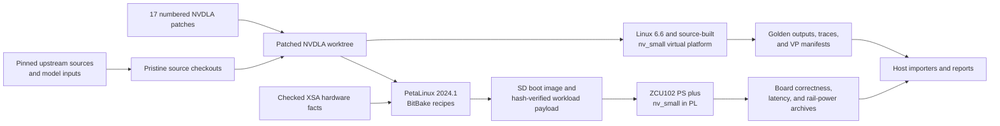

# Modern Linux Support, PetaLinux Integration, and Correctness Evaluation of an nv_small NVDLA FPGA Accelerator

## Abstract

The NVIDIA Deep Learning Accelerator (NVDLA) is an open architecture for neural-network inference, but its public software targets Linux interfaces that predate current kernels and embedded distributions. This work modernizes the NVDLA kernel-mode driver and user-mode runtime for Linux 6.6, integrates them into PetaLinux 2024.1, and evaluates an `nv_small` accelerator in the programmable logic of a Zynq UltraScale+ MPSoC. The public input/output control ABI is preserved. Generic changes form a 17-commit upstream-style series; board-specific integration remains separate.

Correctness is established through layered evidence rather than compilation or probe success. Pinned sources, ABI tests, stock controls, a source-built `nv_small` virtual platform, root-filesystem audits, staged board tests, exact output comparison, and repeat execution progressively validate the system. LeNet/MNIST produced the expected output on the virtual platform and FPGA, including 100 consecutive board inferences without driver reload or logic reset. ResNet-50 completed all 246 hardware layers and matched the independent virtual-platform output.

A controlled five-session campaign measured cold, warm, and loaded-context latency, together with power from the ZCU102's monitored processing-system and programmable-logic rails. At approximately 150 MHz, NVDLA reduced ResNet-50 loaded-context latency from 661.8 ms on four Cortex-A53 cores using FP32 ONNX Runtime to 507.7 ms using INT8, while reducing monitored active energy by 27.7% and incremental energy by 77.6%. The comparison is therefore system-level, not equal-precision. The work demonstrates a reproducible path from legacy accelerator software to correct modern embedded-Linux execution and publishes the tested modernization series in an open-source fork.

## Table of Contents

- [1. Introduction](#1-introduction)
- [2. Technical Background and Related Work](#2-technical-background-and-related-work)
- [3. Research Questions, Requirements, and Method](#3-research-questions-requirements-and-method)
- [4. System Architecture and Reproducibility Design](#4-system-architecture-and-reproducibility-design)
- [5. Modernization of the NVDLA Software Stack](#5-modernization-of-the-nvdla-software-stack)
- [6. Correctness Framework and Virtual-Platform Validation](#6-correctness-framework-and-virtual-platform-validation)
- [7. PetaLinux Integration](#7-petalinux-integration)
- [8. Hardware Bring-Up and Debugging](#8-hardware-bring-up-and-debugging)
- [9. Model-Level Correctness](#9-model-level-correctness)
- [10. Performance, Power, and CPU Methodology](#10-performance-power-and-cpu-methodology)
- [11. Results](#11-results)
- [12. Discussion](#12-discussion)
- [13. Threats to Validity and Limitations](#13-threats-to-validity-and-limitations)
- [14. Reproducibility and Open-Source Contribution](#14-reproducibility-and-open-source-contribution)
- [15. Conclusion and Future Work](#15-conclusion-and-future-work)
- [References](#references)
- [Appendices](#appendices)

## 1. Introduction

Special-purpose accelerators are useful only when software deploys real workloads reliably. A design may meet timing yet remain impractical if its driver cannot allocate memory, submit work, receive interrupts, or coexist with a supported operating system. Reusable open hardware can outlive the kernel and build interfaces for which its software was written.

NVDLA compiles a network into a loadable, opens it in a user-mode runtime, and submits work through a kernel-mode driver (KMD) [2], [4]. This project starts from upstream `nvdla/sw` commit `79538ba1b52b040a4a4645f630e457fa01839e90`, dated September 2019. Its driver reflects the older Linux 4.13 virtual-platform environment, whereas modern Linux has changed Direct Rendering Manager (DRM), Graphics Execution Manager (GEM), shared-buffer, interrupt, and mapping APIs. PetaLinux also expects components to build through Yocto recipes with its compiler, sysroot, flags, packaging, and quality checks.

The target system combines an AMD ZCU102 evaluation board, a Zynq UltraScale+ XCZU9EG multiprocessor system-on-chip (MPSoC), and an existing `nv_small` NVDLA implementation in programmable logic. The original FPGA project established a working NVDLA hardware wrapper and direct bare-metal convolution experiments, but it did not provide a complete modern Linux runtime capable of executing compiled networks [1]. The present project addresses that missing system layer. Its objective is not merely to make `opendla.ko` compile. It is to establish that a modernized, packaged, and reproducible software stack preserves inference correctness on both a controlled virtual platform (VP) and the physical FPGA.

The work asks five principal questions:

1. Can the legacy NVDLA software stack be adapted to Linux 6.6 without changing its public input/output control (ioctl) ABI?
2. Does the adapted KMD and user-mode driver (UMD) preserve end-to-end inference correctness?
3. Can the complete driver and runtime be built reproducibly into PetaLinux 2024.1?
4. Does the integrated stack operate correctly with the physical `nv_small` FPGA implementation, including clocks, interrupts, memory access, and repeated execution?
5. What latency and monitored energy characteristics does this implementation exhibit relative to a standard inference runtime on the onboard Arm CPU?

Success required the original ioctl layout, correct XSA resource binding, a DRM render node, working GEM mappings, interrupt-driven completion, deterministic outputs, repeat stability, and an audited AArch64 root filesystem. Performance samples were accepted only when output and kernel-health checks passed.

The project contributes a reviewable 17-commit modernization series; a pinned correctness framework with VP goldens, differential traces, and machine-readable evidence; PetaLinux recipes and staged board integration that execute LeNet and ResNet-50 exactly; and a controlled latency and rail-power comparison with ONNX Runtime on four Cortex-A53 cores. The tested series is published on a public `nvdla/sw` fork [22].

The following sections introduce the required hardware and software concepts, define the evidence method, explain the modernization and integration, present correctness and performance results, and conclude with validity boundaries and reproducibility instructions.

## 2. Technical Background and Related Work

### 2.1 Neural-network inference and FPGA acceleration

A convolutional neural network (CNN) transforms input tensors through operations such as convolution, activation, pooling, and normalization. Inference applies trained weights without updating them. Convolution combines local input regions with learned filters and offers regular parallelism and predictable reuse, making it suitable for dedicated hardware [2], [16].

A field-programmable gate array (FPGA) contains reconfigurable logic, memories, routing, and arithmetic blocks. It can implement workload-specific pipelines with custom precision and controlled data movement [16]. This project uses NVDLA's signed 8-bit integer (`INT8`) compiler path. Because quantization can change outputs, NVDLA and CPU implementations are validated against separate pinned goldens.

The Zynq UltraScale+ MPSoC combines an Arm processing system (PS) with programmable logic (PL) [11]. Linux runs on the PS and `nv_small` in the PL. A control/status bus (CSB) programs registers, an interrupt reports completion, and AXI reaches shared DRAM through a high-performance port. Correctness therefore depends on DMA visibility, clocks, interrupts, and driver scheduling as well as arithmetic.

### 2.2 NVDLA hardware and software

NVDLA contains a convolution core, Single Data Point Processor (SDP), Planar Data Processor (PDP), Cross-channel Data Processor (CDP), and Rubik format engine. Engines can use memory independently or form fused pipelines [2], [3]. The official scalable design identifies `nv_small` as its verified small configuration, with a 128 KiB convolution buffer [3], [6]. `nv_small`, `nv_full`, and the older `initial` project are not interchangeable; model, KMD, device tree, and compiler must agree.

The compiler converts a network and weights into a binary loadable of operations, dependencies, tensors, and data. The UMD parses it, allocates and binds buffers, and submits a task. The KMD imports memory, schedules descriptors, programs CSB registers, and handles interrupts [4]. In the headless design, the host performs this control work [2].

The KMD is a DRM render driver. A node such as `/dev/dri/renderD128` exposes computation without display-master privileges. GEM manages buffer objects and userspace mappings; DMA-BUF represents shareable buffers as file descriptors; PRIME connects this sharing to DRM. These concepts remain, but their kernel helper APIs evolve [7], [8].

Direct memory access (DMA) lets NVDLA reach DRAM without CPU copies. Non-coherent paths require correct mapping and synchronization. Because the XSA does not establish coherency for HP0, this project does not add `dma-coherent`. Device-tree reserved memory can associate an excluded physical region with a device [10], which is needed for the VP's limited external-memory aperture.

Interface clocks are equally fundamental: a register read can hang if Linux disables an apparently unused PL bus clock. Device-tree clock references and driver ownership express that dependency.

### 2.3 PetaLinux, Yocto, and virtual platforms

PetaLinux is AMD's embedded-Linux environment. It imports a Vivado Xilinx Support Archive (XSA), configures boot software, kernel, device tree, and root filesystem, and builds deployable images [12].

PetaLinux uses Yocto and BitBake recipes to fetch, patch, build, install, and package software while layers separate vendor and local metadata [13]. Both KMD and UMD are therefore built with the image sysroot and audited in the generated root filesystem.

The official VP combines a QEMU Armv8 system with a SystemC NVDLA model. It is register-accurate and supports an `NVDLA_HW_PROJECT` such as `nv_small` [5]. It enables deterministic software debugging but cannot validate physical clocks, DMA, reset, timing, or interrupt wiring.

### 2.4 Prior work and project position

The FPGA project inherited by this work implemented `nv_small` on a ZU9EG device and wrapped it for PS access [1]. Post-implementation results reported 46.94% configurable-logic-block use, 28.22% lookup-table use, 15.17% flip-flop use, 1.27% DSP use, and 7.24% block-RAM use. Timing closed at a nominal 100 MHz with 1.510 ns worst negative slack margin. Its bare-metal interface demonstrated direct convolution but supported only a limited operation path and recorded reset, stride, and large-input limitations. The report consequently identified a complete software stack and model execution as future work. This project realizes that extension without redesigning the accelerator RTL.

Veronesi, Bertozzi, and Krstic examined configurable NVDLA on a mainstream MPSoC [14]. Farshchi, Huang, and Yun integrated it with a RISC-V FireSim system and showed that shared memory affects performance and predictability [15]. FPGA CNN surveys likewise identify toolflows, data movement, and precision as system-level concerns [16].

This project differs in its central research problem. It does not propose a new CNN datapath or compare synthesis configurations. It modernizes an old open software stack, builds a correctness argument across VP and silicon, packages that stack in a current embedded-Linux distribution, and quantifies a complete deployed system. The official VP and software documentation define the intended architecture [4], [5], but the public software base does not provide a tested Linux 6.6/PetaLinux 2024.1 route. The resulting contribution is therefore both software engineering and experimental method.

## 3. Research Questions, Requirements, and Method

The questions become observable requirements. RQ1 requires a Linux 6.6 build with unchanged `nvdla_ioctl.h` structures and numbers and no board policy in generic code. RQ2 requires pinned workloads to match expected outputs under controlled legacy and modern lanes. RQ3 requires PetaLinux-built kernel and userspace packages with provenance. RQ4 requires probe, memory, interrupt, completion, output, and repeat success on ZCU102. RQ5 requires correctness-qualified timing and monitored-power comparisons with a standard CPU runtime.

Compilation proves only source compatibility. Module insertion can succeed while probe fails. A render node proves resource binding, GEM mapping proves a CPU-visible buffer, and a register read proves one CSB transaction; none proves DMA, interrupts, scheduling, or arithmetic. Even one correct task can hide stale-state or interrupt-clear defects.

The evidence hierarchy therefore progresses through source/XSA locks, ABI and build gates, stock controls, configuration-audited VP execution, differential traces, PetaLinux package audits, staged board tests, exact output comparison, and repeat campaigns. Performance is accepted only at the top of this hierarchy.

Every run has a timeout and classification. Logs are scanned for kernel faults, DMA errors, timeouts, resets, and VP transaction errors; serial output, `dmesg`, runtime data, tensors, hashes, and environment facts are archived. Failures can therefore be assigned to build, probe, allocation, initiation, interrupt, completion, output, or comparison.

Virtual and physical evidence have complementary roles. The source-built `nv_small` VP isolates KMD/UMD behavior from the inherited FPGA wrapper and provides an independent software oracle. If modern and legacy paths execute the same loadable and yield the same tensor in the same CMOD, a software regression becomes less likely. The VP still cannot validate physical PL clocks, HP0 non-coherent DMA, reset release, or board interrupt routing. Board inference is consequently required to complete the correctness claim.

## 4. System Architecture and Reproducibility Design

The repository separates immutable inputs, generated work, generic patches, local integration, and evidence. `repro.lock.json` pins upstream Git commits, model files, workload hashes, the XSA hash, tool versions, and expected hardware facts. A pristine `nvdla/sw` checkout is retained under the external source area. A separate patched worktree receives the numbered mail-format patches. This makes it possible to reproduce both the exact tested series and a clean upstream branch without vendoring a large third-party tree.

The overall flow is shown in Figure 1. Solid arrows represent generated or executed products; the evidence path feeds results back into analysis rather than changing source inputs.



**Figure 1. Reproducible build, validation, and evidence flow.** The generic software series is tested first in a controlled VP and then packaged with XSA-derived integration for physical execution.

The modern VP lane uses pinned Linux and Buildroot sources. Buildroot supplies a reproducible AArch64 C/C++ cross toolchain and root filesystem; an explicitly selected external compiler remains a practical fallback. The VP's QEMU memory and SystemC external-memory aperture are configured so DMA buffers occupy addresses visible to the model. The source-built VP is audited through its CMake cache, dynamically linked CMOD path, VP binary hash, CMOD hash, device-tree blob (DTB) hash, module hash, probe compatible string, and workload hashes.

The PetaLinux lane imports the checked-in XSA into a project on the Ubuntu 22.04 Windows Subsystem for Linux (WSL) filesystem. Local recipes fetch the same pinned `nvdla/sw` revision, apply the same queue, build `opendla.ko` for `small`, and build the runtime with Yocto's compiler and sysroot. A local device-tree fragment refines the XSA-generated accelerator node instead of replacing it. Target-side tools conduct preflight, GEM smoke, workload, performance, CPU, and power tests. Large loadables and inputs are delivered separately in a hash-verified SD-card payload, while all runtime outputs remain in temporary target storage until archived.

Each test archive contains a JSON manifest and the evidence appropriate to its stage. Common fields include source commits, patch-series hash, build or container identity, kernel version, module `vermagic`, binary and workload hashes, runner command, timestamps, Linux boot identifier, classification, and pass/fail reason. Performance archives add raw timing profiles, environment state, output checks, and sensor samples. Host importers reject mixed provenance before combining sessions and produce machine-readable summaries, comma-separated tables, plots, and Markdown reports.

Generated source trees, kernel builds, PetaLinux projects, root filesystems, boot images, models, logs, and result archives are intentionally excluded from Git. They are large, tool-generated, and often host-path dependent. Committing them would obscure review and still not guarantee reproducibility. Git instead tracks the lock metadata, patches, recipes, scripts, small expected outputs, tests, and documentation required to regenerate or identify each product. Content hashes connect those instructions to generated evidence.

## 5. Modernization of the NVDLA Software Stack

The 17 commits are narrow compatibility and operability changes based on the pinned upstream revision. They preserve userspace ioctls and contain no ZCU102 addresses, PetaLinux paths, reset policy, or coherency declaration. Local integration consumes but does not enter the generic series.

### 5.1 Modern DRM, GEM, DMA-BUF, and IRQ interfaces

Linux removed or changed helpers used by the old KMD. Basic patches use the kernel's `linux/stdarg.h` and explicit modern C++ includes; substantive changes concern object lifetimes and mappings.

The series replaces removed GEM reference helpers while retaining ownership points. It updates mmap to DRM's current GEM offset mechanism and avoids a recursive callback path. Userspace still sees the same create, map-offset, mmap, and destroy ioctls; the smoke program verifies them by writing and reading a 4096-byte mapped object.

DMA-BUF changed `vmap`/`vunmap` from a raw pointer to `iosys_map`. A small version-aware path uses the modern object without changing bytes or ABI, while existing begin/end CPU access follows the shared-buffer contract [9].

Removed PRIME file-descriptor helpers are replaced by `dma_buf_get()` and `drm_gem_prime_import()`, with standard reference release. Runtime submission tests the resulting ownership path.

Interrupt lookup uses `platform_get_irq()` and managed registration. A missing device-tree resource then failed probe explicitly; correcting the description allowed the unchanged generic driver to process completions without a board fallback.

### 5.2 Platform memory and clock ownership

Modern Linux must know which memory and clocks belong to a device. The driver now calls the standard device-tree reserved-memory initialization path when a `memory-region` is supplied. This solved a concrete VP addressing problem without hard-coding its `0xc0000000` aperture. A platform may provide a reserved DMA pool; another may use its ordinary DMA configuration. The common KMD merely attaches the standard description [10].

Clock management was added with the same optional design. At probe, the KMD requests named `csb_clk` and `m_axi_clk` clocks when the device tree provides them, enables them before register access, and reports their state. Platforms without these names preserve the old behavior. This patch arose from a physical failure in which the device existed and reset completed, yet a CSB read stalled after Linux disabled a PL reference clock that no driver claimed. Owning an interface clock through the common clock framework is the generic Linux solution. It is preferable to a boot argument such as `clk_ignore_unused`, which keeps unrelated clocks enabled and hides the dependency.

The `nv_small` selection is also made explicit. The original build assumed an internal project setting. The patch permits external builds to set `NVDLA_HW_CONFIG=small`, while preserving the previous default. A PetaLinux recipe and VP target can therefore build the same KMD source for a known hardware configuration without editing upstream files. Probe identifies the matched compatible string, providing runtime evidence that `nvidia,nv_small` was selected.

### 5.3 UMD build and runtime behavior

The UMD makefiles retain their defaults but now accept `CC`, `CXX`, `LD`, compilation, and linker overrides. PetaLinux can supply its AArch64 sysroot and flags, select `-no-pie`, and remove the historical current-directory library path. An explicit `<limits>` include fixes a modern compiler dependency.

Device discovery was made configurable through an environment override while retaining the original render-node default. This matters when a system exposes more than one DRM render device, but it does not alter existing deployments. The public runtime and KMD expectations remain unchanged.

Later patches correct a timing-unit error and add opt-in JSON profiling with integer `CLOCK_MONOTONIC_RAW` nanoseconds. It separates context, file, deserialization/allocation, input, binding, blocking execution, extraction, output-file, and cleanup phases. Data is buffered until measurement ends; repeat mode loads once, excludes warm-ups, compares every output in memory, and writes one final golden-check output.

The emulator worker also replaced up to 500 ms polling with a condition-variable wake when work is queued. Task ownership and ordering remain unchanged, but a large fixed userspace delay no longer obscures small models.

The production KMD gains one opt-in diagnostic parameter, `firmware_log`. Its default value of zero suppresses only high-volume firmware progress and debug messages; warnings, errors, probe messages, scheduling behavior, and register operations remain unchanged. Correctness and diagnosis runs select `firmware_log=1`; performance runs select zero and lower the console log level. This permits an explicit quiet-versus-verbose observer-effect check without maintaining a separate production driver.

### 5.4 Upstreamability and verification

Each mail-format patch states its problem, cause, fix, and tested environment. `checkpatch.pl --no-tree`, visible warnings, ABI comparison, VP builds, and PetaLinux builds form the gate. VP, recipes, and public fork use the same queue.

The series is intentionally conservative. It does not convert the historical driver into a new Linux accelerator subsystem design, replace the firmware scheduler, or add board policy to common code. Such redesigns may be valuable later, but they would enlarge the correctness surface. The completed series instead establishes a maintainable Linux 6.6 baseline while preserving old behavior where the compatibility burden remains small.

## 6. Correctness Framework and Virtual-Platform Validation

### 6.1 Deterministic gates and configuration proof

Make targets fetch pinned sources and build toolchain, kernel, rootfs, module, runtime, VP, PetaLinux, workloads, and reports with logs and manifests. Host tests cover locks, XSA facts, ABI constants, hashing, protocols, outputs, timeout classification, power integration, statistics, and provenance. Heavy builds use WSL ext4 storage.

Workload manifests record source, compiler, target, loadable, expected-output, and tolerance identities. The board verifies `SHA256SUMS` before device access. This caught an early text-mode transfer that preserved filenames but changed every payload hash.

For `nv_small`, four layers must agree: the VP binary must link the `nv_small` cycle model (CMOD), the KMD must be compiled for `small`, the device tree must match `nvidia,nv_small`, and the loadable must be compiled for `nv_small`. The configuration audit records `NVDLA_HW_PROJECT=nv_small` from `CMakeCache.txt`, the `ldd` CMOD path, hashes of the VP executable and model library, DTB and module hashes, and the probe compatible string. A mismatch is invalid evidence even if some operations appear to run.

### 6.2 Stock controls and source-built nv_small

The stock `nvdla/vp` container behaved as an `initial` or full control: `opendla_1.ko` worked, while the presumed `opendla_2.ko` small pairing did not. Increased timeouts confirmed this was not merely slow simulation. The image validated the harness but could not support an `nv_small` claim.

The project built VP and CMOD from pinned source with `NVDLA_HW_PROJECT=nv_small`, audited dependencies and CMake state, then booted Linux 6.6, Buildroot, the small KMD, and a matching DTB. This proves the specific oracle rather than asserting that stock NVDLA cannot support small designs.

DMA placement was the main VP issue. Ordinary QEMU RAM produced an incorrect repeated-value output; misaligned memory produced transaction address errors. Extending VP RAM over its external-memory range and reserving a `no-map` DMA pool at `0xc0000000` to `0xc7ffffff` yielded exact LeNet output. This isolated model reachability and motivated generic reserved-memory attachment.

### 6.3 Model and differential evidence

LeNet/MNIST was the primary bring-up oracle. Its ten hardware layers cover four convolution operations, four SDP operations, and two pooling operations while remaining quick enough for repeat and trace analysis. With the pinned image of the digit seven, the source-built modern VP returned `0 2 0 0 0 0 0 124 0 0`. Ten repeated inferences in one boot passed exactly. The repository also supports a 100-repeat VP target, but the inspected retained VP artifact establishes ten, not 100, repetitions; the 100-repeat result reported later is from the physical board.

A differential trace strengthened output evidence. Legacy and modern KMDs used the same VP, CMOD, loadable, and input, completed ten operations, and produced the same hash. After masking 52 expected DMA-address writes per trace, 622 reference and 625 candidate events had no semantic mismatch; extra diagnostic or compatibility events did not change programmed values.

ResNet-50 broadened coverage. The pinned model was compiled for `nv_small`, INT8, with per-kernel quantization and a defined 256-pixel short-side resize followed by a 224 by 224 crop. The source-built VP completed all 246 hardware layers and generated a 1000-element signed output with SHA-256 `842d34f...`. The full hash is stored in the lock metadata. Because the VP run proved the hardware configuration, loadable, input, and operation completion, this output was promoted as the board golden only after the run completed.

### 6.4 The SDP diagnostic and VP boundary

The upstream SDP flatbuffer remains diagnostic. Modern `nv_small` programmed and enabled it without completion; a stock full control reported protocol success but produced a non-golden zero payload. Upstream issue 140 also records stock configuration-test failures [21]. It therefore isolates protocol and single-engine stages but is not a tensor oracle.

End-to-end networks provide stronger evidence because they execute ordered graphs across multiple engines and compare meaningful final tensors. The SDP anomaly remains documented rather than hidden, but it does not contradict exact LeNet and ResNet-50 completion. It may reflect a loadable/configuration assumption or a limitation in the old regression itself; the current evidence does not isolate a single cause.

The VP evidence validates the patched software's ioctl, GEM, DMA-BUF, scheduler, register-programming, interrupt-model, runtime-protocol, and deterministic-output paths in a controlled model. It cannot prove physical AXI reachability, non-coherent cache behavior, FPGA clock ownership, reset timing, or electrical interrupt routing. Those questions are addressed by PetaLinux and staged board tests.

## 7. PetaLinux Integration

### 7.1 Project and device-tree construction

PetaLinux 2024.1 is installed at `/opt/pkg/petalinux/2024.1` in an Ubuntu 22.04 WSL distribution. Generated projects are placed on WSL ext4 storage at `$HOME/build/nvdla-peta/petalinux/zcu102-nvdla`. The host doctor records WSL and Ubuntu identity, PetaLinux settings output, and the tool's unsupported-host warning without treating that warning as a build failure. The completed builds, rather than the warning alone, determine acceptance.

`make petalinux-project` creates a ZynqMP project when absent and imports the checked XSA using the PetaLinux hardware-description workflow [12]. On reuse, it verifies PetaLinux version and XSA hash. The XSA audit identifies wrapper instance `xilNvDlaWrapper_0`, CSB range `0xA0000000` to `0xA000FFFF`, interrupt route `dla_intr` to `pl_ps_irq0` as active high, 64-bit DBB AXI width, HP0 connection, and the two interface clocks. The XSA SHA-256 is `2c4b9c3b...`; full identities are retained in `repro.lock.json` and manifests.

The local `system-user.dtsi` refines the generated `&xilNvDlaWrapper_0` node. It sets `compatible = "nvidia,nv_small"` and preserves the generated `reg`, interrupt, and clock properties. This detail is important. An earlier local fragment created a second node at the same address and thereby lost hardware-derived clock metadata. The corrected approach augments the authoritative XSA-generated description. It does not add `dma-coherent`. Board-specific addresses and interrupt facts remain outside the generic KMD series.

### 7.2 Kernel and userspace recipes

The `opendla` BitBake recipe fetches the pinned NVDLA revision, installs the complete numbered patch queue, selects `NVDLA_HW_CONFIG=small`, and builds against the PetaLinux kernel. Its evidence includes recipe and patch hashes, kernel release, module `vermagic`, build log, and module hash. The resulting tested kernel is `6.6.10-xilinx-v2024.1-g3af4295e00ef`.

The `nvdla-runtime` recipe applies the same queue and builds the UMD with Yocto's `CC`, `CXX`, `LD`, sysroot flags, and linker flags. It retains the proven bundled ARM64 IJG JPEG library path, uses `-no-pie`, and removes the current-directory RPATH from the packaged runtime. It installs `/usr/bin/nvdla_runtime` and `/usr/lib/libnvdla_runtime.so`. Licensing evidence covers the UMD and bundled JPEG component. Runtime-specific Yocto quality findings such as build paths, unsafe RPATH, text relocation, already-stripped binaries, or unresolved file dependencies are treated as failures.

An image append adds both `opendla` and `nvdla-runtime` to `petalinux-image-minimal`. Further recipes install the board workload runners, smoke client, benchmark tools, CPU ONNX Runtime lane, SSH test credentials, and power-monitor support. The module is not automatically loaded and no inference service starts at boot. Manual loading was a deliberate laboratory policy: it allows preflight inspection, preserves evidence before device access, and prevents a faulty accelerator path from making early boot unrecoverable.

### 7.3 Root-filesystem and boot evidence

The rootfs audit checks the built archive and deployment products, not only recipe return codes. It verifies AArch64 ELF identity for the NVDLA executable and library, matching module architecture and `vermagic`, dynamic `NEEDED` closure, absence of unsafe NVDLA runtime RPATHs and host paths, presence of required C++ libraries, expected board tools, and inclusion of `opendla.ko`. Synthetic-rootfs unit tests cover missing binaries, missing libraries, wrong architecture, unsafe RPATH, and a valid package closure.

The latest retained audit passed and recorded hashes for `BOOT.BIN`, `image.ub`, `system.dtb`, rootfs, module, runtime, tools, XSA, and patch queue. CPU benchmark components use a declared `$ORIGIN` search path accepted by their package audit; the NVDLA runtime itself has no unsafe RPATH. This distinction avoids making a broader claim than the evidence supports.

The SD handoff separates the boot image from test data. The boot FAT partition receives PetaLinux boot products, while a deterministic `nvdla-tests` directory contains loadables, inputs, goldens, manifests, and checksums. Target scripts mount this payload read-only for verification and write evidence under `/tmp`. This protects the test oracle from a failed or interrupted run. UART remains sufficient for bring-up, while a fixed test-image SSH credential enables simple host automation and immediate archive retrieval during campaigns.

## 8. Hardware Bring-Up and Debugging

### 8.1 Staged acceptance model

Physical bring-up proceeds through eleven ordered stages: preflight, driver probe, render-node creation, GEM allocation and mapping, runtime submission, interrupt delivery, engine progress, operation completion, output retrieval, tensor comparison, and repeat stability. Each stage answers a different question. Preflight checks that the expected DT and packages exist without touching hardware. Probe establishes resource ownership. Render-node and GEM tests establish userspace access and memory mapping. Submission and interrupt counts distinguish scheduling from hardware progress. Completion logs locate an engine-level stall. Output retrieval separates successful arithmetic from a UMD copy problem. Golden comparison establishes correctness. Repetition exposes stale state and cleanup defects.

The target runner stops after a timeout or hard failure and archives evidence before power cycling. It does not continue to another workload after uncertain accelerator state. This is primarily an experimental-integrity rule: subsequent results would otherwise inherit unknown registers, pending interrupts, or buffers. It also avoids unsafe unload or ad hoc reset operations while a task may be active.

### 8.2 Interrupt description

The first board probe loaded the module and printed the `nvidia,nv_small` match, but then reported `IRQ index 0 not found`. The wrapper's register address was correct, yet the Linux device node did not provide the interrupt resource expected by `platform_get_irq()`. Module insertion alone returned a misleadingly simple shell status; the render-node and log checks correctly classified the probe as incomplete.

Auditing the XSA and generated tree showed the physical route from `dla_intr` to the ZynqMP PL-to-PS interrupt input. The local device-tree integration was corrected to preserve that XSA-derived parent, specifier, and active-high type. On the next clean boot, probe read the hardware version, reset the engine, registered DRM, and created `/dev/dri/renderD128`. The GEM smoke then created, mapped, wrote, and verified a buffer. This established the Linux resource and memory-allocation path without yet claiming accelerator execution.

### 8.3 The stalled CSB read and clock dependency

The first runtime SDP attempt made progress through task parsing and reached `dla_prepare_operation`, then stopped at a read of offset `0x9004`. A diagnostic-only KMD printed paired CSB read begin/end markers and DMA-buffer samples. The unmatched begin marker located the stall at physical address `0xA0009004`, before operation programming or interrupt wait. Linux reported read-copy-update stalls because the runtime thread remained in the kernel submission path.

Read-only U-Boot checks, each after a separate reboot, returned `0x00010001` at the NVDLA base and zero at offsets `0x4000` and `0x9004`. This showed that the PL register path could respond before Linux. Repeating the Linux checks with the temporary kernel argument `clk_ignore_unused` also allowed the CSB read to return; the driver then programmed and enabled SDP. The decisive difference was not register contents but clock lifetime.

Inspection of the Vivado sources and generated device tree identified `csb_clk` and `m_axi_clk` connections. Linux's clock summary showed the relevant PL reference clock, but the duplicate local device node did not claim it. The permanent correction preserved the generated clock properties and added optional clock acquisition to the generic KMD. Subsequent probe logged enabled interface clocks and no longer needed the broad boot argument. This sequence is a useful systems lesson: a bus read that hangs only after Linux boot can indicate clock ownership, not necessarily a bad address or broken RTL.

### 8.4 From engine progress to tensor evidence

With clocks and interrupt routing corrected, the diagnostic SDP task could be parsed, programmed, and enabled. Its lack of completion remained classified as the known standalone diagnostic outcome; the runner did not extrapolate from it. LeNet was then run from a fresh boot with verbose firmware progress. All ten expected operations completed in order, the NVDLA interrupt count increased, the runtime exited normally, and the output vector matched the VP golden exactly.

ResNet-50 provided a much longer execution trace. The final messages showed convolution operation 244 and SDP operation 245 completing, followed by `246 HWLs done, totally 246 layers` and normal engine reset. An early runner then encountered an unrelated `awk` syntax error while analysing the already completed output. Because execution logs and temporary files were preserved, the script defect could be fixed without confusing it with accelerator failure. The subsequent archive completed analysis successfully and matched the promoted VP hash.

The staged method prevented premature attribution. The missing interrupt was device-tree integration; the submission hang was clock ownership; an apparent post-ResNet failure was analysis code; and the standalone SDP result remained unresolved. None was treated as proof that the FPGA arithmetic or modern driver was wrong. Conversely, exact multi-engine model outputs and positive interrupt evidence provide much stronger support than successful register access alone.

## 9. Model-Level Correctness

LeNet and ResNet-50 occupy different roles in the evidence. LeNet is small, fast, and interpretable. The original family was developed for document recognition [17], and this project uses a pinned Caffe LeNet/MNIST variant, calibration table, and 28 by 28 grayscale image of the digit seven. The NVDLA compiler command selects `fast-math`, `INT8`, per-filter quantization, NCHW layout, and `nv_small`. The generated loadable is 445,736 bytes with SHA-256 `4b6aa8...`. The expected raw output is the ten-value vector `0 2 0 0 0 0 0 124 0 0`, whose largest value identifies class seven.

The source-built VP produced that vector exactly. The physical board then completed the same ordered four-convolution, four-SDP, two-PDP graph and produced the same output hash. Most importantly, a dedicated board stability archive records 100 requested and 100 passing runs in one boot, without module reload or PL reset. Every run had the expected operation sequence, a positive interrupt-count delta, the same output hash, and no classified bad kernel pattern. This directly addresses reset, interrupt-clear, scheduler-cleanup, and stale-state concerns raised by a single successful inference.

ResNet-50 is a deeper residual image-classification model [18]. The pinned Caffe source and weights come from the original model repository identified in the lock file. Input preparation resizes the image to a 256-pixel short side and takes a 224 by 224 crop. Compilation uses `nv_small`, `INT8`, `fast-math`, and per-kernel quantization. The 25,765,680-byte loadable has SHA-256 `1be9c2...` and describes 246 hardware layers: 114 convolution, 130 SDP, and two PDP operations.

The source-built VP completed all 246 layers and produced a 1000-element output with SHA-256 `842d34...`. That output was then promoted as the board golden. Three dedicated board execution archives completed all layers and produced the same hash. The earliest board archives were conservatively labelled `execution-pass-oracle-pending` because the independent VP output was still running; the later promotion and final campaign establish exact comparison. No separate 100-repeat ResNet gate is claimed. Instead, its final performance campaign contains repeated correctness-qualified executions across independent boots.

Table 1 summarizes the retained model-level evidence. Ellipses in hashes indicate that full values are recorded in `repro.lock.json` and run manifests, not that the identity is approximate.

| Model | Input and graph | Loadable | Source-built `nv_small` VP | Physical ZCU102 | Repeat evidence | Classification |
|---|---|---:|---|---|---|---|
| LeNet/MNIST | `1x1x28x28`; 10 HWLs | 445,736 B, `4b6aa8...` | Exact ten-value vector | Exact same vector and hash | 100/100 board runs | Exact correctness and stability pass |
| ResNet-50 | `1x3x224x224`; 246 HWLs | 25,765,680 B, `1be9c2...` | 1000 values, `842d34...` | 246/246 HWLs and same hash | Repeated accepted campaign runs; no dedicated 100-run gate | Exact model-level correctness pass |

**Table 1. Model-level correctness evidence.** LeNet supplies fast, interpretable repeat coverage; ResNet-50 supplies a much larger, multi-engine operation graph.

## 10. Performance, Power, and CPU Methodology

Measurement begins only after correctness. The production stack runs with `firmware_log=0`, console level 3, and output redirected from UART. Each process still checks its golden and kernel health; wrong output, timeout, or kernel fault rejects the sample.

### 10.1 Timing regimes and instrumentation

Three regimes separate costs. **Cold deployment** measures a new process from launch to exit after cache dropping, including SD reads, model setup, inference, output, and teardown. **Warm deployment** repeats that boundary with primed file caches. **Loaded-context inference** loads and binds once, excludes warm-ups, and times blocking `IRuntime::submit()` calls. This *runtime execution latency* includes UMD, ioctl/KMD scheduling, hardware, interrupt completion, and loadable emulator work, not pure RTL cycles.

Intervals use integer `CLOCK_MONOTONIC_RAW` nanoseconds. The profiler records clock-call overhead and buffers output. It groups model loading, input/binding, runtime execution, extraction, and end-to-end time, while cold loading separates file reads from deserialization, GEM allocation, and population.

The benchmark records the NVDLA clock, Linux boot identifier, kernel and binary hashes, workload dimensions, loadable size, hardware-layer counts, operation counts, CPU affinity, governor and frequencies, context-switch information where available, load average, memory state, and sensor status. NVDLA runs are pinned to CPU 2; the power sampler uses CPU 3. The measured PL reference clock was 149,985,000 Hz, within 16 Hz of the XSA value 149,985,016 Hz. Host-observed equivalent cycles can be calculated as runtime execution seconds multiplied by this clock, but are labelled as such because the interval includes software around the hardware.

Each cohort contains five fresh boots. Session medians are the units for deterministic percentile-bootstrap 95% intervals. Raw samples and descriptive statistics remain available. Tukey 1.5-IQR fences flag outliers, but discard none.

### 10.2 Power measurement

The ZCU102 exposes current, voltage, and power monitors across multiple supply rails. The image enables the required I2C multiplexer and hardware-monitor drivers. Eighteen labelled rails are sampled from Linux `hwmon`, including PS rails such as `VCCPSINTFP`, `VCCPSINTLP`, `VCCPSAUX`, and DDR-related supplies, and PL-facing rails such as `VCCINT`, `VCCBRAM`, and `VCCAUX`. The INA226 class of monitor reports shunt current, bus voltage, and power through I2C [20]; the board guide documents the ZCU102's monitor topology [11].

Power is sampled every 50 ms during a loaded-context batch, with a driver-loaded idle window and final endpoint. Exact monotonic launcher boundaries align samples. Rails are grouped into PS, PL, and monitored total; trapezoidal integration divided by accepted inference count estimates energy.

**Active power** is the inference-window total; **incremental power** subtracts driver-loaded idle. Samples remain signed. The total covers exposed rails, not 12 V input, regulator loss, or every peripheral. Powered cohorts remain separate because CPU and I2C sampling can perturb latency.

Network Time Protocol (NTP) synchronization improves human-readable archive timestamps but has no effect on monotonic timing or integration. Fresh sessions are identified by Linux boot IDs, so a board without a battery-backed real-time clock does not weaken the independence test.

### 10.3 ARM CPU comparison

The baseline uses ONNX Runtime 1.18.1 CPU Execution Provider [19]. Pinned Caffe weights are converted once to ONNX and checked before and after each session at tolerance `1e-5`. Four Cortex-A53 threads use affinity `0xf` and the existing userspace governor fixed near 1.2 GHz; the wrapper records but does not change it.

The CPU benchmark defines cold, warm, and loaded-session timing analogously, although its steady interval is ONNX Runtime inference rather than NVDLA `submit()`. Primary latency is collected without power sampling. Powered sessions use the same rail sampler; because all four A53 cores execute the model, the sampler necessarily shares CPU resources and may perturb those cohorts. This is why powered latency is secondary.

The comparison is deliberately described as a deployed-system implementation comparison. NVDLA executes an `INT8` compiler-generated loadable; the CPU executes an FP32 ONNX graph. Source weights and model families agree, and both paths are independently correctness-qualified, but numerical representation, graph transformations, runtime kernels, and output scales differ. The results answer how these two practical software/hardware stacks behave on the board, not which processor wins an equal-precision convolution microbenchmark.

### 10.4 Final campaign selection

The final set contains 40 sessions: NVDLA and CPU latency and power cohorts for both models, each with five fresh boots. Two extra CPU LeNet power sessions were excluded solely to preserve the balanced design. `campaign-selection.json` records every archive and hash; the importer rejects mixed provenance.

## 11. Results

### 11.1 Correctness and workload scale

All 40 selected final sessions passed their output and system-health qualification. The NVDLA cohorts used the VP-backed exact goldens described in Section 9; the CPU cohorts passed ONNX model tests against their own FP32 expected outputs. No selected run contains an accelerator timeout or classified kernel error. This condition is essential: the following latency and energy values describe correct inferences, not merely processes that returned.

Workload scale explains much of the behavior. NVDLA LeNet has a 0.446 MB loadable and ten hardware layers, while ResNet-50 has a 25.77 MB loadable and 246 hardware layers. The CPU ONNX files are 1.73 MB with 11 graph nodes and 102.48 MB with 178 nodes, respectively. The deeper model provides more accelerator work over which to amortize fixed process, runtime, and memory-management costs.

### 11.2 Latency and throughput

Table 2 reports the median of the five independent session medians. Parentheses show deterministic 95% bootstrap intervals over those five values. Ratios are CPU latency divided by NVDLA latency, so values above one favor NVDLA.

| Model | Regime | NVDLA INT8 latency (ms) | CPU FP32 latency (ms) | CPU / NVDLA |
|---|---|---:|---:|---:|
| LeNet | Cold deployment | 34.47 (33.96-34.56) | 216.47 (216.08-219.86) | 6.28x |
| LeNet | Warm deployment | 16.88 (16.85-16.95) | 165.06 (165.01-165.14) | 9.78x |
| LeNet | Loaded-context inference | 1.698 (1.696-1.699) | 0.900 (0.897-0.954) | 0.53x |
| ResNet-50 | Cold deployment | 1336.23 (1332.53-1336.76) | 4905.77 (4902.65-4910.67) | 3.67x |
| ResNet-50 | Warm deployment | 773.81 (773.29-774.41) | 2754.98 (2749.14-2756.90) | 3.56x |
| ResNet-50 | Loaded-context inference | 507.72 (507.718-507.722) | 661.83 (660.86-662.47) | 1.30x |

**Table 2. Primary unpowered latency results.** NVDLA greatly reduces deployment latency for both models, while loaded-context acceleration becomes beneficial only for the larger ResNet-50 workload.

The corresponding mean-derived throughputs reinforce the distinction. For LeNet, NVDLA achieves 28.70 cold, 54.84 warm, and 588.94 loaded-context images/s; CPU achieves 4.60, 6.06, and 1079.45 images/s. For ResNet-50, NVDLA achieves 0.748, 1.286, and 1.970 images/s; CPU achieves 0.204, 0.363, and 1.511 images/s. Throughput here is the reciprocal of the stated latency boundary, not a multi-request pipelined measurement.

Figure 2 presents the absolute results with separate visual scale appropriate to the regimes. Figure 3 shows the same relationship as CPU/NVDLA latency, making the break-even line explicit.


**Figure 2. Correctness-qualified latency by model and regime.** Primary values come from unpowered five-boot cohorts; points and intervals represent between-session evidence.


**Figure 3. Relative latency.** Values above 1.0 indicate lower NVDLA latency. Small LeNet execution is faster on the optimized four-core CPU, but NVDLA reduces full deployment time; ResNet-50 favors NVDLA in all three regimes.

Runtime phase profiles show where time remains. For LeNet, median cold model loading is 16.24 ms and runtime execution is about 1.96 ms; warm model loading falls to 5.10 ms. Median warm overhead beyond loaded-context execution is 15.18 ms, or 89.94% of warm end-to-end time. For ResNet-50, cold model loading is 763.85 ms and runtime execution 508.04 ms; warm model loading is 212.34 ms. Its warm overhead is 266.09 ms, or 34.39%. The event-driven UMD worker removed a large avoidable polling component, but allocation, model handling, process setup, input work, and teardown remain visible.

### 11.3 Monitored power and energy

Table 3 reports medians from the separate five-boot powered cohorts. Active energy includes all monitored PS and PL rail power over the loaded-context inference process, amortized per inference. Incremental energy subtracts the driver-loaded idle baseline.

| Model | Stack | Active power (W) | Incremental power (W) | Active energy/inference | Incremental energy/inference |
|---|---|---:|---:|---:|---:|
| LeNet | NVDLA INT8 | 3.540 | 0.353 | 6.300 mJ | 0.627 mJ |
| LeNet | CPU FP32 | 3.117 | 0.531 | 5.693 mJ | 0.970 mJ |
| ResNet-50 | NVDLA INT8 | 3.450 | 0.259 | 1.781 J | 0.134 J |
| ResNet-50 | CPU FP32 | 3.440 | 0.833 | 2.463 J | 0.597 J |

**Table 3. ZCU102 monitored rail power and energy.** These are exposed PS-plus-PL rail totals, not external board-input measurements.

For LeNet, NVDLA uses 13.6% more active power and 10.7% more active energy than the CPU, but 35.3% less incremental energy. The short inference leaves fixed system power important, so active and incremental interpretations differ. For ResNet-50, active power is nearly equal, with NVDLA 0.3% higher, but faster completion reduces active energy by 27.7%. Its incremental energy is 77.6% lower because accelerator execution raises monitored power much less above idle than four-core CPU execution does.

Figures 4 and 5 separate power level from time-integrated energy. This is necessary because similar watts can produce very different joules when latency differs.


**Figure 4. Monitored power during loaded-context batches.** Active totals are similar for ResNet-50, while the incremental component is substantially lower for NVDLA.


**Figure 5. Monitored energy per correct inference.** ResNet-50 shows the clearest accelerator benefit because its useful work amortizes fixed system cost and finishes sooner than the FP32 CPU path.

## 12. Discussion

Usefulness depends on workload and timing boundary. ResNet-50 favors NVDLA in every regime: loaded-context execution is 1.30 times faster and deployment more than 3.5 times faster than CPU. The larger deployment ratio indicates advantages from both the precompiled loadable path and accelerator execution.

For LeNet, CPU loaded-context execution is faster, 0.900 ms against 1.698 ms. NVDLA control costs cannot be amortized across ten layers, although its cold and warm deployment remains much faster. The two boundaries answer different system questions.

Almost 90% of warm LeNet deployment lies outside execution, whereas ResNet-50 execution dominates. Complexity amortizes control but raises loadable, deserialization, and memory costs; the 25.77 MB loadable helps explain ResNet's 212 ms warm loading. Both utilization and deployment remain optimization targets.

Power results require similar care. Active power includes the platform's existing PS and PL consumption, so a short task can finish before idle energy is well amortized. Incremental energy asks a different question: how much additional monitored energy is associated with executing the inference above an already booted, driver-loaded platform. LeNet's active energy slightly favors CPU while incremental energy favors NVDLA. ResNet-50 favors NVDLA under both definitions, with a particularly large incremental reduction. Reporting both prevents an idle-baseline choice from determining the narrative.

The measured 149.985 MHz clock differs from the original 100 MHz report and ASIC deployments. Results should not be scaled without accounting for AXI bandwidth, memory, configuration, and software; host-observed equivalent cycles also contain software and interrupt latency.

The most transferable result is the correctness method: retain an oracle, prove configuration, stage hardware access, archive each boundary, compare multi-engine output, repeat, and qualify performance. Differential traces show that the modern driver preserved tested legacy programming behavior.

The CSB investigation likewise avoided a polling workaround or RTL change. Bootloader comparison and clock inspection found the dependency, producing a generic optional-clock patch instead of a broad `clk_ignore_unused` requirement.

Generic API, resource, build, and runtime fixes belong in `nvdla/sw`; XSA addresses, board topology, recipes, credentials, payloads, and analysis remain local. This makes the fork reusable while preserving the experiment here.

The comparison with CPU should remain constructively bounded. It demonstrates real deployed alternatives available on this board: an INT8 NVDLA compilation flow and an FP32 four-thread ONNX Runtime flow. It does not isolate precision, kernel implementation, or model-conversion effects. Nevertheless, the ResNet-50 result establishes that the integrated accelerator can improve both latency and monitored energy for a nontrivial network. LeNet establishes where fixed overhead dominates. Together they are more informative than choosing only a workload favorable to one side.

## 13. Threats to Validity and Limitations

### 13.1 Internal validity

Every performance process checks output and kernel health. Pinned binaries, workloads, clocks, affinity, governor state, and boot IDs prevent mixing. Primary latency excludes power sampling; monotonic clocks, buffered profiles, measured timer overhead, quiet logging, and redirected UART reduce instrumentation effects.

Some observer effect remains: CPU workers share cores with the sampler, I2C adds activity, and 50 ms sampling cannot resolve short transients. Endpoint capture improves integration, and these effects do not affect primary unpowered latency.

NVDLA uses compiler-quantized INT8 while ONNX Runtime uses FP32. Shared model families and independent checks do not remove conversion differences, so results concern deployed stacks rather than an equal-precision causal estimate.

### 13.2 External and construct validity

External validity is bounded by one ZCU102, FPGA wrapper, Linux/PetaLinux release, and `nv_small`. Standard APIs and no board constants support transfer, but other boards and kernels need testing; future adaptation remains likely.

Two networks cannot represent all NVDLA workloads. LeNet covers a small graph and repeat behavior; ResNet-50 covers a much larger convolution/SDP graph. They do not exercise every supported operator, tensor shape, fusion mode, or precision. The standalone SDP regression remains inconclusive as a tensor oracle and warrants separate investigation. `nv_full` was useful as a stock control but did not receive the same source-built physical evaluation.

Construct validity concerns whether the measurements represent the named quantities. Runtime execution latency is a host-observed blocking interval, not pure accelerator compute time. Cold and warm deployment deliberately include software costs because deployment is a system property. Throughput is reciprocal single-inference latency, not concurrent pipeline capacity. Monitored power sums exposed PS and PL rails and is not wall-plug or 12 V input power. Active and incremental energy are both presented because neither alone captures all deployment questions.

The VP is register-accurate, not a timing-equivalent physical model [5]. It supports software correctness and differential behavior but cannot predict board latency or validate clocks, non-coherent DMA, resets, and physical interrupts. Conversely, board agreement with a VP golden is strong end-to-end evidence but does not prove mathematical correctness for all possible inputs or compiler transformations.

### 13.3 Statistical validity

Five independent boots per final cohort provide a defensible view of session-to-session variation but remain a modest sample. Bootstrap intervals describe the distribution of those five session medians; they are not universal confidence bounds for all boards or environments. Within-session repetitions improve median stability but do not create independent boot samples. The deterministic method aids reproduction, while retaining every outlier avoids hidden selection. Two extra LeNet CPU power runs were excluded under the balanced design before comparison, and their identities remain recorded.

Temperature was recorded as available or unavailable rather than silently omitted. The final campaign controlled settle time, frequency, workload, and boot independence, but it did not impose a climate-controlled ambient condition. This is another reason not to overgeneralize small power differences, particularly the 0.3% ResNet active-power difference. The much larger latency and incremental-energy differences are less sensitive to that specific uncertainty.

These limitations define the scope of the demonstrated system. Within that scope, exact outputs, repeated execution, independent boots, complete provenance, and conservative comparison boundaries provide coherent evidence for the modernization and integration claims.

## 14. Reproducibility and Open-Source Contribution

Reproducibility is implemented as a property of the workflow rather than a final list of commands. `repro.lock.json` identifies the upstream NVDLA base, Linux and Buildroot commits, VP and hardware commits, PetaLinux metadata, ONNX Runtime version, XSA, models, inputs, compiler options, expected outputs, and hashes. Fetch scripts verify these identities. Build outputs live under ignored external, work, and artifact directories; tracked source explains how to regenerate them.

The main workflow is exposed through make targets. `make sources` and heavy-source variants acquire inputs. `make patch-check` and `make abi-check` validate the series. VP targets build the pinned toolchain, kernel, rootfs, KMD, UMD, `nv_small` CMOD, executable, DTB, workloads, and correctness gates. PetaLinux targets create and audit the project, install device-tree and power integration, build KMD and runtime recipes, compose the image, audit the rootfs, package boot files, and generate the board payload. Board scripts run one explicit workload or benchmark and download its archive over SSH. Host importers validate provenance before producing per-stack and comparative reports.

Artifacts use a stable run-directory schema. A manifest records what was built or run, the command and environment, source and binary identities, and the classification. Raw serial, `dmesg`, runtime, output, interrupt, timing, and sensor files remain beside derived analyses. The final campaign adds an explicit selection manifest, allowing another researcher to determine exactly which 40 archives formed each table and which files were excluded. Generated evidence need not be trusted by filename alone because its SHA-256 is recorded.

Version-control history is structured by concern: strategy and lock checks, source and build lanes, ABI and VP gates, workloads, PetaLinux integration, board stages, profiling, power, CPU comparison, and campaign reporting. Driver patch updates are separate from harness commits. Before publication, the complete 17-patch queue was applied with `git am` to the pinned upstream base and pushed unchanged to the public `modern-linux-support` branch [22]. This preserves commit-level authorship and review context. Future upstream-facing documentation can be added directly to that fork without mixing local board policy into the software series.

An independent reproduction follows eight steps. First, clone this repository and acquire pinned sources. Second, apply and verify the NVDLA queue. Third, build the source-selected `nv_small` VP stack and establish LeNet and ResNet goldens. Fourth, import the checked XSA into PetaLinux 2024.1 and build recipes and images. Fifth, generate and verify the model payload. Sixth, boot the ZCU102 and run preflight, probe, smoke, model, and repeat gates in order. Seventh, run fresh-boot latency and power sessions and retrieve archives. Eighth, import those archives and regenerate the final summaries and plots. Appendix A gives the principal commands; the detailed runbooks remain the operational authority.

The public fork is a practical contribution independent of the dissertation harness. A maintainer can start from the upstream base and use the tested commits without taking the PetaLinux project, models, board credentials, or evidence store. Conversely, a researcher can use this repository to reproduce the complete ZCU102 experiment. This separation supports both reuse and auditability.

## 15. Conclusion and Future Work

This work demonstrates that the legacy NVDLA software stack can be modernized for Linux 6.6 while preserving its public ioctl ABI. Standard DRM, GEM, DMA-BUF, IRQ, reserved-memory, and clock interfaces replace obsolete assumptions. Cross-build and runtime patches permit clean PetaLinux packaging and controlled profiling. The resulting 17 commits remain small enough to review individually and are published in an upstream-derived fork.

Correctness was established beyond compilation and probe success. A verified source-built `nv_small` VP reproduced exact LeNet output, matched legacy and modern driver traces, and established a ResNet-50 golden after 246 completed hardware layers. PetaLinux 2024.1 built the same KMD and UMD into an audited AArch64 image. On the physical ZCU102, staged tests found and corrected interrupt description and interface-clock ownership issues, after which LeNet and ResNet-50 matched their VP-backed outputs. LeNet passed 100 consecutive executions without module reload or PL reset. These results answer the first four research questions affirmatively within the tested platform and workloads.

The performance evidence answers the fifth question with a workload-dependent result. At approximately 150 MHz, the `nv_small` implementation reduced ResNet-50 loaded-context latency from 661.8 ms on the four-core FP32 CPU stack to 507.7 ms on the INT8 accelerator stack. It also reduced monitored active energy by 27.7% and incremental energy by 77.6%. Tiny LeNet executed faster in the CPU's loaded context, showing the effect of fixed accelerator control costs, while NVDLA still had much lower cold and warm deployment latency. This balanced result is useful because it identifies both the accelerator's effective operating region and the software overhead that future work can target.

Future work should test additional supported networks, inputs, boards, and kernel releases; add continuous integration for compile, ABI, and VP gates; and maintain the public fork as Linux evolves. Equal-precision CPU experiments would isolate more of the hardware effect. External 12 V instrumentation would extend monitored-rail energy to whole-board input energy. The standalone SDP regression should be investigated without weakening the end-to-end oracle policy. Broader source-built `nv_full` validation and deployment policy suitable for non-laboratory images would further extend the work.

The completed project turns an inherited FPGA accelerator and an old software release into a documented modern embedded-Linux system. Its main contribution is not one compatibility fix or one benchmark number, but a reproducible chain of evidence from source patch to exact model output and controlled physical measurement.

## References

[1] J. U. Georgis, "Evaluating Deep Learning Acceleration on FPGA: NVDLA Case Study," University of Manchester Project Report, 2025. [Local PDF](JacobReport-FPGA.pdf).

[2] NVIDIA, "NVDLA Primer," *NVDLA Documentation*. [https://nvdla.org/primer.html](https://nvdla.org/primer.html).

[3] NVIDIA, "NVDLA Hardware Manual" and "Scalability Parameters and ConfigROM," *NVDLA Documentation*. [https://nvdla.org/hw/contents.html](https://nvdla.org/hw/contents.html), [https://nvdla.org/hw/v2/scalability.html](https://nvdla.org/hw/v2/scalability.html).

[4] NVIDIA, "Runtime Environment," *NVDLA Software Manual*. [https://nvdla.org/sw/runtime_environment.html](https://nvdla.org/sw/runtime_environment.html).

[5] NVIDIA, "Virtual Platform," *NVDLA Documentation*. [https://nvdla.org/vp.html](https://nvdla.org/vp.html).

[6] NVIDIA, "Open NVDLA Repository Updates," 2018. [https://nvdla.org/updates.html](https://nvdla.org/updates.html).

[7] Linux Kernel Documentation, "DRM Internals," Linux 6.6. [https://docs.kernel.org/6.6/gpu/drm-internals.html](https://docs.kernel.org/6.6/gpu/drm-internals.html).

[8] Linux Kernel Documentation, "DRM Memory Management," Linux 6.6. [https://docs.kernel.org/6.6/gpu/drm-mm.html](https://docs.kernel.org/6.6/gpu/drm-mm.html).

[9] Linux Kernel Documentation, "Buffer Sharing and Synchronization (DMA-BUF)." [https://docs.kernel.org/6.11/driver-api/dma-buf.html](https://docs.kernel.org/6.11/driver-api/dma-buf.html).

[10] Devicetree Specification Project, "Reserved Memory Binding." [https://github.com/devicetree-org/dt-schema/blob/main/dtschema/schemas/reserved-memory/reserved-memory.yaml](https://github.com/devicetree-org/dt-schema/blob/main/dtschema/schemas/reserved-memory/reserved-memory.yaml).

[11] AMD, *ZCU102 Evaluation Board User Guide*, UG1182, v1.7, Feb. 2023. [https://docs.amd.com/v/u/en-US/ug1182-zcu102-eval-bd](https://docs.amd.com/v/u/en-US/ug1182-zcu102-eval-bd).

[12] AMD, *PetaLinux Tools Documentation: Reference Guide*, UG1144, v2024.1, June 2024. [https://docs.amd.com/r/2024.1-English/ug1144-petalinux-tools-reference-guide/Introduction](https://docs.amd.com/r/2024.1-English/ug1144-petalinux-tools-reference-guide/Introduction).

[13] Yocto Project, "Yocto Project Concepts" and *BitBake User Manual*. [https://docs.yoctoproject.org/current/overview-manual/concepts.html](https://docs.yoctoproject.org/current/overview-manual/concepts.html), [https://docs.yoctoproject.org/bitbake/dev/](https://docs.yoctoproject.org/bitbake/dev/).

[14] A. Veronesi, D. Bertozzi, and M. Krstic, "Assessing the Configuration Space of the Open Source NVDLA Deep Learning Accelerator on a Mainstream MPSoC Platform," in *VLSI-SoC: Selected Contributions from the 28th IFIP/IEEE International Conference*, IFIP Advances in Information and Communication Technology, vol. 621, pp. 87-112, Springer, 2021. doi: [10.1007/978-3-030-81641-4_5](https://doi.org/10.1007/978-3-030-81641-4_5).

[15] F. Farshchi, Q. Huang, and H. Yun, "Integrating NVIDIA Deep Learning Accelerator (NVDLA) with RISC-V SoC on FireSim," arXiv:1903.06495, 2019. [https://arxiv.org/abs/1903.06495](https://arxiv.org/abs/1903.06495).

[16] K. Abdelouahab, M. Pelcat, J. Serot, and F. Berry, "Accelerating CNN Inference on FPGAs: A Survey," arXiv:1806.01683, 2018. [https://arxiv.org/abs/1806.01683](https://arxiv.org/abs/1806.01683).

[17] Y. LeCun, L. Bottou, Y. Bengio, and P. Haffner, "Gradient-Based Learning Applied to Document Recognition," *Proceedings of the IEEE*, vol. 86, no. 11, pp. 2278-2324, 1998. doi: [10.1109/5.726791](https://doi.org/10.1109/5.726791).

[18] K. He, X. Zhang, S. Ren, and J. Sun, "Deep Residual Learning for Image Recognition," in *Proceedings of the IEEE Conference on Computer Vision and Pattern Recognition*, pp. 770-778, 2016. doi: [10.1109/CVPR.2016.90](https://doi.org/10.1109/CVPR.2016.90).

[19] Microsoft, "ONNX Runtime Execution Providers" and "Thread Management." [https://onnxruntime.ai/docs/execution-providers/](https://onnxruntime.ai/docs/execution-providers/), [https://onnxruntime.ai/docs/performance/tune-performance/threading.html](https://onnxruntime.ai/docs/performance/tune-performance/threading.html).

[20] Texas Instruments, *INA226 36-V, 16-Bit, Ultra-Precise I2C Output Current, Voltage, and Power Monitor With Alert*, SBOS547B, revised Sept. 2024. [https://www.ti.com/lit/ds/symlink/ina226.pdf](https://www.ti.com/lit/ds/symlink/ina226.pdf).

[21] NVDLA Project, "Some configurations failed in regression test," `nvdla/sw` issue 140, 2019. [https://github.com/nvdla/sw/issues/140](https://github.com/nvdla/sw/issues/140).

[22] B. B., "NVDLA software with modern Linux support," public `nvdla/sw` fork, `modern-linux-support` branch, commit `8ee626ed91da52755414f5c36d7788bcb4b90c6a`. [https://github.com/BerkantB0/nvdla-sw/tree/modern-linux-support](https://github.com/BerkantB0/nvdla-sw/tree/modern-linux-support).

## Appendices

### Appendix A. Key Reproduction Commands

The exact environment variables and prerequisites are documented in [the reproducible runbook](reproducible-runbook.md). The principal host gates are:

```sh
make sources-heavy sources-vp sources-lenet sources-resnet50
make patch-check abi-check unit
make vp-toolchain vp-kernel vp-rootfs vp-runtime
make vp-small-cmod-docker vp-small-bin-docker vp-small-dtb
NVDLA_KMD_CONFIG=small make vp-kmod
make vp-small-config-audit vp-lenet-small-gate vp-trace-small-gate
make vp-resnet50-small-golden-promote
```

Inside the Ubuntu 22.04 PetaLinux environment:

```sh
make petalinux-project petalinux-dts petalinux-power
NVDLA_KMD_CONFIG=small make petalinux-kmod
make petalinux-runtime petalinux-board-tools petalinux-image
make petalinux-rootfs-audit petalinux-package petalinux-sd-bundle
make petalinux-board-payload
```

After writing the boot files and `nvdla-tests` payload to the SD card, the staged board commands are:

```sh
nvdla-board-check preflight
nvdla-board-check probe
nvdla-board-check smoke
nvdla-board-workload lenet /run/media/ROOT-mmcblk0p1/nvdla-tests
REPEAT=10 nvdla-board-workload lenet /run/media/ROOT-mmcblk0p1/nvdla-tests
REPEAT=100 nvdla-board-workload lenet /run/media/ROOT-mmcblk0p1/nvdla-tests
nvdla-board-workload resnet50 /run/media/ROOT-mmcblk0p1/nvdla-tests
```

The host wrapper performs one selected benchmark after a fresh boot and downloads its archive:

```sh
scripts/run_board_benchmark.sh nvdla resnet50 \
  --cold-starts 1 --warm-starts 2 \
  --warmups 1 --steady-samples 3 \
  --settle-seconds 10 --power --power-idle-seconds 5

scripts/run_board_benchmark.sh cpu resnet50 \
  --precision fp32 --threads 4 \
  --cold-starts 1 --warm-starts 2 \
  --steady-samples 3 --settle-seconds 10 \
  --power --power-idle-seconds 5
```

### Appendix B. Upstream Patch-Series Summary

| No. | Area | Change |
|---:|---|---|
| 1 | UMD | Allow render-node override from the environment |
| 2 | KMD | Use the kernel standard-argument header |
| 3 | KMD | Handle modern DMA-BUF `vmap` with `iosys_map` |
| 4 | KMD | Update DRM GEM reference helpers |
| 5 | KMD | Use modern IRQ and GEM mmap paths |
| 6 | UMD | Include standard numeric limits definitions |
| 7 | UMD | Allow runtime executable linker flags |
| 8 | KMD | Permit external `nv_small` build selection |
| 9 | KMD | Attach device-tree reserved memory |
| 10 | KMD | Replace removed DRM PRIME fd helpers |
| 11 | UMD | Accept standard cross-build tools and flags |
| 12 | KMD | Manage optional NVDLA interface clocks |
| 13 | UMD | Correct elapsed-time units |
| 14 | UMD | Add opt-in structured runtime profiling |
| 15 | KMD | Make firmware progress logging opt-in |
| 16 | UMD | Record profiling clock overhead |
| 17 | UMD | Wake the emulator worker when work is queued |

### Appendix C. Hardware and Workload Facts

| Item | Locked value |
|---|---|
| Board / device | ZCU102 / Zynq UltraScale+ XCZU9EG |
| NVDLA configuration | `nv_small` |
| Wrapper instance | `xilNvDlaWrapper_0` |
| CSB range | `0xA0000000`-`0xA000FFFF` |
| Interrupt | `dla_intr` to `pl_ps_irq0`, active high |
| DBB path | 64-bit AXI to `S_AXI_HP0_FPD`; treated non-coherent |
| Interface clocks | `csb_clk`, `m_axi_clk` |
| Measured NVDLA reference clock | 149,985,000 Hz |
| Target kernel | `6.6.10-xilinx-v2024.1-g3af4295e00ef` |
| LeNet | `1x1x28x28`, INT8, 10 HWLs, exact vector oracle |
| ResNet-50 | `1x3x224x224`, INT8, 246 HWLs, 1000-value hash oracle |
| CPU runtime | ONNX Runtime 1.18.1 CPU EP, FP32, four A53 threads |

### Appendix D. Evidence and Report Locations

- Final comparative source of truth: [`artifacts/final-reports/comparison/campaign-summary.json`](../artifacts/final-reports/comparison/campaign-summary.json)
- Human-readable campaign report: [`artifacts/final-reports/comparison/campaign-report.md`](../artifacts/final-reports/comparison/campaign-report.md)
- Source-built VP configuration audit: `artifacts/20260708T194754Z-vp-small-config-audit/`
- Legacy/modern trace comparison: `artifacts/20260721T224807Z-vp-trace-diff-small/`
- VP ResNet-50 golden: `artifacts/20260726T004806Z-vp-modern-resnet50-small/`
- Board LeNet 100-repeat import: `artifacts/20260725T-stability100-petalinux-board-import/`
- PetaLinux rootfs audit: `artifacts/20260804T213531Z-petalinux-rootfs-audit/`
- First-board procedure: [ZCU102 first-boot runbook](zcu102-first-boot-runbook.md)
- Measurement definitions: [NVDLA performance methodology](nvdla-performance-methodology.md)
- CPU baseline definitions: [Arm CPU comparison methodology](arm-cpu-comparison-methodology.md)

### Appendix E. Selected Diagnostic Markers

The following short markers locate the two main board integration failures without reproducing full UART logs:

```text
NVDLA a0000000.nvdla: error -ENXIO: IRQ index 0 not found
nvdla-trace csb-read begin offset=0x00009004
```

After correcting the XSA-derived interrupt description and claiming the interface clocks, the passing path reported:

```text
Probe NVDLA config nvidia,nv_small
interface clocks: csb=enabled m_axi=enabled
[drm] Initialized nvdla ... on minor 0
246 HWLs done, totally 246 layers
```
