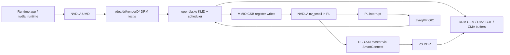

# NVDLA on PetaLinux/ZCU102 Compatible Version Evaluation

## Executive Summary

If the PetaLinux 2024.2 constraint is removed, the best software-compatible
baseline is PetaLinux/Vivado 2018.3, because its Xilinx kernel recipe uses
Linux 4.14. Upstream NVDLA `sw` says the Linux KMD was verified on Linux 4.13.3
for ARM64, so 2018.3 is the closest PetaLinux-era target to the driver's
known-good kernel interface.

The practical fallback is PetaLinux/Vivado 2019.2, which uses Linux 4.19. It is
still much closer to the upstream KMD than Linux 5.x or 6.x releases, while
being less far from the XSA/Vitis-era flow used by more recent Xilinx tools.

The tradeoff changes from the 2024.2 analysis:

- Using PetaLinux 2018.3 or 2019.2 lowers Linux DRM/GEM/DMA-BUF driver porting
  risk.
- It raises hardware tooling risk, because the attached FPGA report was built
  with Vivado/Vitis 2024.2. The NVDLA RTL and wrapper concepts should be
  portable, but the block design, PS configuration, IP versions, and hardware
  handoff may need to be recreated in the older Xilinx release.
- If the existing hardware can only be maintained in Vivado 2024.2, the
  original PetaLinux 2024.2 path remains viable, but it is a driver-forward-port
  project against Linux 6.6.40.

Recommended path:

| Priority | Baseline | Use When | Feasibility Verdict |
| ---: | --- | --- | --- |
| 1 | PetaLinux/Vivado 2018.3, Linux 4.14 | Driver compatibility is the top priority and the hardware can be recreated or exported for the 2018.3 flow. | Best software match, medium effort, with hardware-tooling risk. |
| 2 | PetaLinux/Vivado 2019.2, Linux 4.19 | 2018.3 tooling is unavailable or too old, but a pre-5.x kernel is still desired. | Best practical fallback, medium effort. |
| 3 | PetaLinux/Vivado 2024.2, Linux 6.6.40 | The 2024.2 Vivado project/XSA must be preserved. | Hardware-flow match, but medium-high driver port effort. |

Estimated effort:

| Milestone | 2018.3 Path | 2019.2 Path | 2024.2 Path |
| --- | ---: | ---: | ---: |
| Version and hardware rebaseline spike | 2-4 days | 2-4 days | 1-2 days |
| First KMD/UMD hardware smoke test | 1-3 engineering weeks | 2-4 engineering weeks | 2-4 engineering weeks |
| Robust runtime execution | 3-6 engineering weeks | 4-7 engineering weeks | 4-8 engineering weeks |
| Extra hardware backport/recreation, if needed | +1-3 engineering weeks | +0.5-2 engineering weeks | Not needed if current XSA is valid |

Overall conclusion: NVDLA on ZCU102 PetaLinux remains viable. Without the 2024.2
constraint, the lowest-risk software integration path is to target PetaLinux
2018.3 first, then fall back to 2019.2 if old toolchain or hardware-handoff
friction dominates.

## Scope And Assumptions

Assumptions used in this evaluation:

- Target board: Xilinx/AMD ZCU102 evaluation board with Zynq UltraScale+ ZU9EG.
- Hardware instance: one NVDLA `nv_small` instance in programmable logic.
- Software base: upstream [`nvdla/sw`](https://github.com/nvdla/sw).
- Hardware basis: attached FPGA report,
  [JacobReport-FPGA.pdf](/home/berkant/.codex/attachments/40b0f266-ab73-45ab-b0f9-5aa77967bd63/JacobReport-FPGA.pdf).
- Goal: run NVDLA KMD, UMD, and runtime on the ARM Cortex-A53 cores under
  PetaLinux.
- This document is a companion to
  [nvdla-petalinux-feasibility.md](/srv/syncthing/data/COMP66060/Exploration/NVDLA-Peta/docs/nvdla-petalinux-feasibility.md).

The FPGA paper's `0xA0000000` NVDLA register base is treated as provisional.
The selected hardware handoff, whether HDF or XSA, must be the source of truth
for register address, IRQ, clock, reset, AXI route, and DMA address width.

## Source Basis

Software sources reviewed:

- [`nvdla/sw` README](https://github.com/nvdla/sw/blob/master/README.md):
  Linux KMD is an out-of-tree module, verified on Linux 4.13.3 for ARM64, using
  DRM and GEM PRIME for DMA-capable buffer allocation and sharing.
- [KMD platform driver](https://github.com/nvdla/sw/blob/master/kmd/port/linux/nvdla_core_callbacks.c):
  MMIO register access, IRQ handling, platform probe, and compatible strings.
- [KMD GEM/DMA path](https://github.com/nvdla/sw/blob/master/kmd/port/linux/nvdla_gem.c):
  DRM GEM allocation, PRIME export, mmap, and DMA address lookup.
- [UMD Linux port](https://github.com/nvdla/sw/blob/master/umd/port/linux/nvdla.c):
  opens the DRM render node, allocates GEM buffers, maps memory, and submits
  tasks through NVDLA ioctls.
- [NVDLA device-tree binding](https://github.com/nvdla/sw/blob/master/kmd/Documentation/devicetree/bindings/nvdla/nvdla.txt):
  useful reference, but the binding compatible string does not exactly match
  the current KMD match table.

PetaLinux and Xilinx kernel sources reviewed:

- [PetaLinux/meta-xilinx 2018.3 kernel recipe](https://raw.githubusercontent.com/Xilinx/meta-xilinx/rel-v2018.3/meta-xilinx-bsp/recipes-kernel/linux/linux-xlnx_2018.3.bb):
  `LINUX_VERSION = "4.14"` and branch `xlnx_rebase_v4.14`.
- [PetaLinux/meta-xilinx 2019.2 kernel recipe](https://raw.githubusercontent.com/Xilinx/meta-xilinx/rel-v2019.2/meta-xilinx-bsp/recipes-kernel/linux/linux-xlnx_2019.2.bb):
  `LINUX_VERSION = "4.19"` and branch `xlnx_rebase_v4.19`.
- [PetaLinux/meta-xilinx 2020.2 kernel recipe](https://raw.githubusercontent.com/Xilinx/meta-xilinx/rel-v2020.2/meta-xilinx-bsp/recipes-kernel/linux/linux-xlnx_2020.2.bb):
  `LINUX_VERSION = "5.4"`.
- [PetaLinux/meta-xilinx 2021.1 kernel recipe](https://raw.githubusercontent.com/Xilinx/meta-xilinx/rel-v2021.1/meta-xilinx-bsp/recipes-kernel/linux/linux-xlnx_2021.1.bb):
  `LINUX_VERSION = "5.10"` and branch `xlnx_rebase_v5.10`.
- [PetaLinux/meta-xilinx 2022.1 kernel recipe](https://raw.githubusercontent.com/Xilinx/meta-xilinx/rel-v2022.1/meta-xilinx-core/recipes-kernel/linux/linux-xlnx_2022.1.bb):
  `LINUX_VERSION = "5.15.19"` and branch
  `xlnx_rebase_v5.15_LTS_2022.1_update`.
- [PetaLinux/meta-xilinx 2024.2 kernel recipe](https://raw.githubusercontent.com/Xilinx/meta-xilinx/rel-v2024.2/meta-xilinx-core/recipes-kernel/linux/linux-xlnx_6.6.40-v2024.2.bb):
  `LINUX_VERSION = "6.6.40"` and branch `xlnx_rebase_v6.6_LTS`.
- [PetaLinux/meta-xilinx 2025.1 kernel recipe](https://raw.githubusercontent.com/Xilinx/meta-xilinx/rel-v2025.1/meta-xilinx-core/recipes-kernel/linux/linux-xlnx_6.12.10-v2025.1.bb):
  `LINUX_VERSION = "6.12.10"` and branch
  `xlnx_rebase_v6.12_LTS_2025.1_update`.

Hardware source basis from the attached FPGA report:

- ZCU102/ZU9EG target.
- NVDLA `nv_small` in programmable logic.
- PS programs NVDLA registers through an APB-to-CSB path.
- NVDLA DBB master reaches PS DDR through AXI SmartConnect and a ZynqMP
  high-performance slave interface.
- PL interrupt is routed to the PS.
- 100 MHz timing closure was reported.
- Bare-metal tests validated CSB register access, SDP pass-through memory
  traffic, and direct convolution register control.
- Full Linux KMD/UMD/runtime integration was not demonstrated.

## Version Compatibility Matrix

| Baseline | Kernel | Driver Port Risk | Hardware Tooling Risk | Recommendation |
| --- | --- | --- | --- | --- |
| Upstream NVDLA KMD validation point | Linux 4.13.3 | None, reference point | N/A | Target to stay close to. |
| PetaLinux/Vivado 2018.3 | Linux 4.14 | Low to medium | High | Best software-compatible target if hardware can be recreated or exported for 2018.3. |
| PetaLinux/Vivado 2019.2 | Linux 4.19 | Medium | Medium | Best practical fallback if 2018.3 is too old or difficult to support. |
| PetaLinux/Vivado 2020.2 | Linux 5.4 | Medium-high | Medium | Acceptable only if older tools are blocked. |
| PetaLinux/Vivado 2021.1 | Linux 5.10 | High | Medium-low | Not preferred for first bring-up. |
| PetaLinux/Vivado 2022.1 | Linux 5.15.19 | High | Medium-low | Not preferred for first bring-up. |
| PetaLinux/Vivado 2024.2 | Linux 6.6.40 | High to very high | Low | Best match to the paper's current tool flow, not to the old KMD. |
| PetaLinux/Vivado 2025.1 | Linux 6.12.10 | Very high | Low | No advantage for first NVDLA driver bring-up. |

Why 2018.3 is the best software match:

- Linux 4.14 is only one minor LTS generation after the KMD's Linux 4.13.3
  validation point.
- The old NVDLA KMD uses Linux DRM/GEM/DMA-BUF interfaces from the same era.
- The amount of compatibility patching should be significantly smaller than for
  Linux 5.x or 6.x.
- ZCU102 and ZynqMP support were mature in this release family.

Why 2019.2 is the preferred fallback:

- Linux 4.19 is still close enough to reduce driver API churn relative to
  PetaLinux 2024.2.
- It is closer to the XSA/Vitis transition than 2018.3, which can reduce
  hardware handoff friction.
- It may be easier to install and operate on available hosts than the 2018.3
  toolchain.

Why 2024.2 is no longer preferred when version choice is open:

- Linux 6.6.40 is far from the KMD's validated kernel.
- The KMD's older DRM/GEM/DMA-BUF idioms will likely require a real forward
  port.
- 2024.2 is still attractive only if preserving the exact Vivado/Vitis 2024.2
  hardware project matters more than minimizing driver work.

## Proposed Architecture

The runtime architecture is unchanged by the PetaLinux version choice. The
version mainly changes how much driver porting is needed and how the hardware
handoff is generated.



Software packaging:

- Package `opendla.ko` as a PetaLinux out-of-tree module recipe.
- Package the NVDLA UMD/runtime as a userspace recipe.
- Do not import upstream `prebuilt/` or regression blobs into the layer.
- Keep the KMD ioctl ABI from `nvdla_ioctl.h`: submit, GEM create, GEM mmap,
  and GEM destroy.
- Add one user-facing UMD polish item: configurable render node path, defaulting
  to `/dev/dri/renderD128`.

Device-tree target:

```dts
nvdla@a0000000 {
    compatible = "nvidia,nv_small";
    reg = <0x0 0xa0000000 0x0 0x10000>;
    interrupts = <0 89 4>;
};
```

The address, size, and interrupt above must be checked against the selected
HDF/XSA and Vivado address map. Do not add a coherent-DMA property for the
current XSA: the audited DBB path reaches DDR through `S_AXI_HP0_FPD` and the
coherency flags are off. The KMD's current match table supports
`nvidia,nv_small`; the binding file's `nvidia,nvdla-1` string should either be
added to the driver or avoided in the initial device tree.

## Recommended Implementation Path

### Phase 0: Version Gate

Perform a short spike before committing to the full integration:

1. Confirm whether Vivado/PetaLinux 2018.3 can be installed and licensed on the
   available host or in a supported VM.
2. Try to recreate or backport the report's NVDLA block design in Vivado 2018.3.
3. If 2018.3 hardware export is blocked after 2-4 days, repeat the spike with
   Vivado/PetaLinux 2019.2.
4. If both older flows are blocked, return to the PetaLinux 2024.2 plan and
   treat the KMD as a Linux 6.6 forward-port.

Exit criteria:

- ZCU102 project builds a bitstream with NVDLA `nv_small` at 100 MHz or an
  accepted lower clock for early bring-up.
- Hardware handoff is usable by the matching PetaLinux release.
- Address map includes NVDLA CSB aperture.
- PL-to-PS interrupt is present.
- NVDLA DBB AXI master reaches PS DDR.

### Phase 1: Hardware Rebaseline

For 2018.3:

- Expect the SDK/HDF-era hardware handoff flow rather than the modern
  Vivado/Vitis 2024.2 XSA flow.
- Recreate the ZynqMP PS configuration, AXI APB bridge to NVDLA CSB,
  SmartConnect, HP/HPC DDR path, clocking, reset, and interrupt connection.
- Keep the NVDLA wrapper behavior from the paper: APB-to-CSB for register
  programming and DBB AXI master for memory traffic.
- Preserve the `nv_small` configuration that matches the KMD's
  `atom_size = 8`, BDMA disabled, Rubik disabled, and weight compression
  disabled.

For 2019.2:

- Prefer a native 2019.2 project export if possible.
- If importing newer design collateral fails, recreate the block design rather
  than trying to coerce incompatible IP metadata.
- Keep the same address, IRQ, AXI, reset, and clock audit checklist as 2018.3.

Bare-metal sanity checks are still useful before Linux:

- CSB read/write.
- SDP pass-through DBB memory traffic.
- Interrupt assertion and clear.
- Optional smallest convolution/direct register test.

### Phase 2: PetaLinux Project

Create a PetaLinux project matching the selected Xilinx release:

- Start from the ZCU102 BSP when available.
- Import the matching HDF/XSA hardware handoff.
- Add `system-user.dtsi` NVDLA node using `compatible = "nvidia,nv_small"`.
- Enable module loading, DRM, DMA-BUF, CMA, OF/platform devices, and DMA mapping
  support.
- Reserve enough CMA memory for NVDLA buffers.
- Disable SMMU or configure it deliberately; do not leave address translation
  ambiguous.

Kernel configuration items to verify:

- `CONFIG_MODULES`
- `CONFIG_DRM`
- `CONFIG_DMA_SHARED_BUFFER`
- `CONFIG_CMA`
- `CONFIG_DMA_CMA`
- `CONFIG_OF`
- `CONFIG_OF_IRQ`
- `CONFIG_UIO` only if using a temporary debug driver; it is not needed for the
  final NVDLA KMD path.

### Phase 3: KMD Bring-Up

Use upstream `nvdla/sw` as the KMD base:

1. Build `opendla.ko` against the selected PetaLinux kernel without source
   changes first. This measures the real API drift.
2. Patch compile failures minimally, preserving the existing DRM ioctl ABI.
3. Keep the `nv_small` KMD configuration.
4. Reconcile the device-tree compatible string.
5. Add explicit probe logging for base address, IRQ, DMA mask, and config name.
6. Boot the board and confirm the platform driver probes.
7. Confirm that the render node appears under `/dev/dri/`.

Expected patch areas on 2018.3:

- Kernel Makefile integration inside the PetaLinux module recipe.
- Include path cleanup for DRM headers.
- Small API differences in DRM device registration or GEM helpers.

Expected patch areas on 2019.2:

- Same as 2018.3, plus higher likelihood of DRM helper signature changes.
- DMA-BUF vmap/vunmap compatibility may need wrapper macros.

Expected patch areas on 2024.2, if the fallback to 6.6 is required:

- DRM legacy registration cleanup.
- GEM CMA helper replacement or compatibility layer.
- `dma_buf_vmap()` API changes.
- PRIME and mmap helper updates.
- Kernel time API and include cleanup.

### Phase 4: UMD And Runtime

Package the UMD/runtime as userspace software:

- Build in the PetaLinux SDK/sysroot for ARM64.
- Use the exact `nvdla_ioctl.h` shipped with the KMD recipe.
- Patch the hardcoded `/dev/dri/renderD128` path to accept an environment
  variable such as `NVDLA_RENDER_NODE`, while keeping the current default.
- Keep the compiler/loadable generation off-board for the first milestone.
- Package a smallest known-good loadable or board-specific smoke-test app only
  after licensing and provenance are checked.

### Phase 5: Hardware Bring-Up Test Sequence

Bring the system up in layers:

1. Boot PetaLinux with the bitstream loaded.
2. Confirm `dmesg` shows NVDLA probe success and the selected config.
3. Confirm IRQ resource and render node creation.
4. Use a temporary KMD debug path or minimal ioctl test to read/write a harmless
   CSB register.
5. Allocate and mmap a GEM buffer from userspace.
6. Confirm CPU writes are visible to the accelerator and accelerator writes are
   visible to the CPU.
7. Exercise interrupt-driven completion.
8. Run SDP pass-through before convolution or full runtime.
9. Run the smallest available NVDLA loadable.
10. Repeat 100+ runs with cache enabled and collect failure signatures.

## Version-Specific Risks And Mitigations

| Risk | Applies Most To | Impact | Mitigation |
| --- | --- | --- | --- |
| Old Xilinx tools are hard to install or unsupported on the current host OS. | 2018.3, 2019.2 | Medium-high | Use a supported VM image, freeze tool versions, and decide after a 2-4 day spike. |
| Vivado 2024.2 design cannot be opened by older tools. | 2018.3, 2019.2 | High | Recreate the block design manually using the report's topology instead of downgrading project metadata. |
| HDF/XSA flow mismatch. | 2018.3 | Medium | Treat 2018.3 as an HDF/SDK-era flow and document exact export/import commands. |
| Kernel security and maintenance age. | 2018.3, 2019.2 | Medium | Use older release only for bring-up and feasibility; plan a later forward-port if the project becomes productized. |
| DRM/GEM helper API drift still exists. | All | Medium | Compile KMD early and patch incrementally; keep ioctl ABI stable. |
| DMA coherency/cache behavior differs from bare-metal tests. | All | High | Use DMA API backed buffers, verify `dma-coherent` only if true, test with cache enabled. |
| Repeated-run stalls seen in the paper persist under Linux. | All | High | Add reset/recovery strategy, instrument interrupts, run stress tests, and validate task cleanup. |
| Compiler/loadable stack is old. | All | Medium | Generate loadables off-target, pin known-good test artifacts, and avoid board-side compiler work initially. |

## Decision Checklist

Choose PetaLinux/Vivado 2018.3 if all are true:

- The team can install and run the 2018.3 toolchain.
- The NVDLA hardware can be recreated or exported for the 2018.3 flow.
- The priority is fastest KMD compatibility rather than matching the paper's
  exact 2024.2 tool environment.
- Security/maintenance limitations of an old Linux release are acceptable for
  prototype bring-up.

Choose PetaLinux/Vivado 2019.2 if any are true:

- 2018.3 host/tool support is too painful.
- The hardware handoff flow works better with 2019.2.
- A slightly newer Xilinx release is worth a moderate increase in KMD porting
  risk.

Choose PetaLinux/Vivado 2024.2 if any are true:

- The current 2024.2 XSA/bitstream must be used without recreation.
- Tool support, reproducibility, or institutional constraints rule out older
  releases.
- The team is prepared to forward-port the NVDLA KMD to Linux 6.6.40.

## Proposed Work Breakdown

1. Version spike:
   - Install or provision 2018.3.
   - Attempt ZCU102 project creation and NVDLA hardware rebaseline.
   - Record blockers and decide whether to continue or switch to 2019.2.

2. Hardware audit:
   - Confirm CSB base address.
   - Confirm IRQ ID and trigger type.
   - Confirm clock frequency and reset control.
   - Confirm DBB AXI path to DDR.
   - Confirm DMA address width and coherency route.

3. PetaLinux integration:
   - Create matching PetaLinux project.
   - Add NVDLA device-tree node.
   - Add kernel config fragment.
   - Add KMD out-of-tree module recipe.
   - Add UMD/runtime recipe.

4. KMD patch and build:
   - Compile against selected kernel.
   - Apply minimal API compatibility patches.
   - Preserve `nvdla_ioctl.h` ABI.
   - Add probe diagnostics.

5. UMD/runtime patch and build:
   - Add configurable render node path.
   - Cross-compile against the matching sysroot.
   - Package sample app and minimal test loadable workflow.

6. Board bring-up:
   - Boot, probe, render node.
   - CSB smoke test.
   - IRQ smoke test.
   - GEM allocation/mmap.
   - DBB memory traffic.
   - SDP pass-through.
   - Small loadable execution.
   - 100+ run stability test.

## Final Recommendation

Use PetaLinux/Vivado 2018.3 for the first compatibility-focused attempt. It is
the closest PetaLinux target to the upstream NVDLA KMD's Linux 4.13.3 validation
point and should minimize driver surgery.

Set a hard 2-4 day gate for the 2018.3 hardware rebaseline. If the old Vivado
flow blocks progress, move to PetaLinux/Vivado 2019.2. If the hardware cannot
reasonably be recreated outside the report's Vivado/Vitis 2024.2 project, keep
2024.2 and budget for the larger Linux 6.6 KMD forward-port documented in the
original feasibility evaluation.
