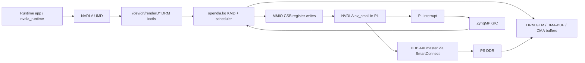

# NVDLA on PetaLinux/ZCU102 Feasibility Evaluation

## Executive Summary

Running the NVDLA Linux drivers and runtime on the ARM cores of a ZCU102
PetaLinux system is feasible, but it is not a drop-in integration. The current
FPGA work demonstrates the most important hardware prerequisites: an `nv_small`
NVDLA instance can be implemented on the Zynq UltraScale+ MPSoC programmable
logic, the PS can write NVDLA registers through the CSB path, and NVDLA can
issue DBB AXI memory traffic into PS DDR. The missing work is the Linux
software integration around that hardware.

The recommended path is to use upstream [`nvdla/sw`](https://github.com/nvdla/sw)
as the software base and package its Kernel Mode Driver (KMD) as an
out-of-tree PetaLinux kernel module, with the User Mode Driver (UMD) and
runtime sample packaged as userspace applications. Expect the main effort to be
forward-porting old Linux/DRM/DMA-BUF code, reconciling the device tree binding
with the actual KMD match table, validating DMA coherency on the ZynqMP PS-PL
memory path, and proving repeated inference stability.

Estimated effort:

| Milestone | Estimate | Notes |
| --- | ---: | --- |
| Feasibility and design documentation | 1 day | This document. |
| First KMD/UMD hardware smoke test | 2-4 engineering weeks | Compile, boot, bind driver, allocate buffers, exercise CSB/interrupt/DMA. |
| Robust runtime execution | 4-8 engineering weeks | Reliable loadable execution, repeat runs, cache-enabled operation, model workflow. |

Overall risk is medium-high, mostly because upstream NVDLA software is old. The
KMD README says it was verified on Linux 4.13.3 for ARM64, while PetaLinux
2024.2 uses a much newer AMD vendor kernel. The hardware side is encouraging,
but the software integration should be treated as a driver port and bring-up
project rather than a package-only task.

## Scope And Assumptions

Assumptions used in this evaluation:

- Target board: Xilinx/AMD ZCU102 evaluation board with Zynq UltraScale+
  ZU9EG.
- Tool baseline: Vivado/PetaLinux 2024.2.
- Hardware handoff: XSA plus bitstream are available.
- Hardware instance: one NVDLA `nv_small` instance in programmable logic.
- Software goal: run KMD, UMD, and runtime on the ARM Cortex-A53 cores under
  PetaLinux.
- Immediate deliverable: Markdown evaluation and implementation plan.

Out of scope for the first bring-up:

- Re-architecting NVDLA RTL for FPGA efficiency.
- Building a production inference framework integration.
- Running the NVDLA compiler on the ZCU102 target.
- Supporting multiple NVDLA instances.

## Sources Reviewed

- Upstream software: [`nvdla/sw`](https://github.com/nvdla/sw)
- Upstream hardware: [`nvdla/hw`](https://github.com/nvdla/hw), especially
  [`nv_small`](https://github.com/nvdla/hw/tree/nv_small)
- Software manual: [NVDLA Software Manual](https://nvdla.org/sw/contents.html)
- Runtime documentation:
  [NVDLA Runtime Environment](https://nvdla.org/sw/runtime_environment.html)
- Hardware integration documentation:
  [NVDLA Integrator's Manual](https://nvdla.org/hw/v1/integration_guide.html)
- KMD platform/interrupt/register code:
  [`kmd/port/linux/nvdla_core_callbacks.c`](https://github.com/nvdla/sw/blob/master/kmd/port/linux/nvdla_core_callbacks.c)
- KMD GEM/DMA path:
  [`kmd/port/linux/nvdla_gem.c`](https://github.com/nvdla/sw/blob/master/kmd/port/linux/nvdla_gem.c)
- UMD Linux port:
  [`umd/port/linux/nvdla.c`](https://github.com/nvdla/sw/blob/master/umd/port/linux/nvdla.c)
- Device tree binding:
  [`kmd/Documentation/devicetree/bindings/nvdla/nvdla.txt`](https://github.com/nvdla/sw/blob/master/kmd/Documentation/devicetree/bindings/nvdla/nvdla.txt)
- Attached report:
  [JacobReport-FPGA.pdf](/home/berkant/.codex/attachments/40b0f266-ab73-45ab-b0f9-5aa77967bd63/JacobReport-FPGA.pdf)

## Current Hardware State From The FPGA Report

The attached report is a strong starting point for Linux integration because it
already demonstrates the basic PS to PL and PL to PS paths that the Linux KMD
needs.

Observed hardware properties:

- The design targets ZCU102/ZU9EG and uses the ARM Cortex-A53 APU as the host.
- The implemented accelerator is NVDLA `nv_small`.
- The design uses a wrapper around NVDLA to expose the DBB interface as AXI and
  to bridge APB to NVDLA CSB.
- The PS master path programs NVDLA registers. In the paper's Vivado design,
  the provisional NVDLA register base is `0xA0000000`.
- The NVDLA DBB master path reaches PS DDR through AXI SmartConnect and a ZynqMP
  PS high-performance slave interface.
- A PL to PS interrupt port is exposed.
- The reported clock is 100 MHz, with positive timing slack.
- Bare-metal tests validated:
  - CSB register write/read through the PS to PL configuration path.
  - SDP pass-through memory traffic through the NVDLA DBB path.
  - Direct convolution control through manual register programming.

Important limitations from the report:

- The existing software was standalone/bare-metal, not PetaLinux.
- The direct register-control interface has known functional limitations:
  vertical stride issues, repeated-run stalls requiring reset, and freezes for
  larger inputs.
- The bare-metal code used direct pointers and cache disable/flush behavior.
  Linux must replace this with DMA API backed memory allocation and coherent or
  explicitly synchronized mappings.
- The report did not validate the upstream KMD scheduler, UMD, NVDLA loadables,
  or the interrupt-driven Linux completion path.

The hardware appears sufficient for a Linux bring-up attempt, but the XSA must
be treated as the source of truth for address ranges, IRQ number, clocking,
reset topology, AXI route, and DMA address width.

## Upstream Software Review

### Software Stack

NVDLA software is split into:

- Compiler library: converts trained models into NVDLA loadables.
- UMD/runtime: loads NVDLA loadables, allocates buffers, binds tensors, and
  submits inference jobs.
- KMD: receives jobs from userspace, schedules hardware layers, writes NVDLA
  registers, handles interrupts, and manages DMA-capable buffers.

For ZCU102 deployment, the practical target is runtime-only execution on the
board. Build or obtain loadables separately, preferably on an x86 host, then
copy loadables to the PetaLinux rootfs. Building the old compiler stack on the
board should not be on the critical path.

### Kernel Mode Driver

The Linux KMD is already structured as an out-of-tree kernel module:

- Build output: `opendla.ko`
- Entry point: Linux platform driver in `kmd/port/linux/nvdla_core_callbacks.c`
- Firmware scheduler sources: `kmd/firmware/*.c`
- Memory manager: DRM/GEM/PRIME in `kmd/port/linux/nvdla_gem.c`
- Build model: external kernel module using `KDIR`, `ARCH=arm64`, and
  `CROSS_COMPILE`.

Key KMD behavior:

- Maps the NVDLA register aperture with `devm_ioremap_resource`.
- Registers a platform IRQ handler.
- Calls `dla_isr_handler()` in the ISR and wakes a completion.
- Calls `dla_process_events()` in process context after an interrupt.
- Uses `writel()` and `readl()` for NVDLA CSB register access.
- Allocates DMA-capable GEM buffers with the Linux DMA API.
- Exposes DRM ioctls for task submission and buffer management.

The KMD has built-in configuration records:

| Compatible string in current KMD | Intended config | Key parameters |
| --- | --- | --- |
| `nvidia,nvdla_os_initial` | OS initial/full-ish config | `atom_size = 32`, BDMA/Rubik/compression enabled |
| `nvidia,nv_small` | Small config | `atom_size = 8`, BDMA/Rubik/compression disabled |
| `nvidia,nv_large` | Large config | `atom_size = 32`, BDMA/Rubik/compression disabled |

For the paper's hardware, `nvidia,nv_small` is the best initial device tree
compatible string.

### User Mode Driver And Runtime

The Linux UMD uses the DRM render node to communicate with KMD:

- Default device path is hardcoded as `/dev/dri/renderD128`.
- Buffer allocation uses `DRM_IOCTL_NVDLA_GEM_CREATE`.
- GEM handles are converted to PRIME file descriptors.
- Buffers are mapped with `DRM_IOCTL_NVDLA_GEM_MMAP` and `mmap`.
- Task submission uses `DRM_IOCTL_NVDLA_SUBMIT`.

This is a usable base, but it needs minor target polish:

- Make the render node configurable through an environment variable or command
  line option, while keeping `/dev/dri/renderD128` as the default.
- Ensure the userspace header used by UMD exactly matches the KMD ioctl header.
- Avoid relying on old bundled DRM headers if PetaLinux sysroot headers are
  available and compatible.

### Driver Interface To Preserve

Keep the upstream DRM ioctl ABI unless there is a clear kernel-porting reason
to change it:

| Operation | Interface |
| --- | --- |
| Submit inference task | `DRM_IOCTL_NVDLA_SUBMIT` |
| Create DMA/GEM buffer | `DRM_IOCTL_NVDLA_GEM_CREATE` |
| Map DMA/GEM buffer | `DRM_IOCTL_NVDLA_GEM_MMAP` |
| Destroy DMA/GEM buffer | `DRM_IOCTL_NVDLA_GEM_DESTROY` |

Preserving the ABI keeps UMD changes small and avoids creating a second,
board-specific runtime API.

## Proposed Architecture



Expected runtime flow:

1. Application starts and loads an NVDLA loadable.
2. UMD opens `/dev/dri/renderD*`.
3. UMD allocates input, output, weight, and intermediate buffers through KMD GEM
   ioctls.
4. UMD maps buffers into userspace and populates input data.
5. UMD submits a task descriptor and address list to KMD.
6. KMD scheduler writes NVDLA CSB registers and starts layer execution.
7. NVDLA reads/writes DDR through its DBB AXI master.
8. NVDLA raises an interrupt.
9. KMD processes scheduler events, marks task completion, and returns to UMD.
10. Application reads output buffers and validates results.

## PetaLinux Integration Design

### Hardware Handoff Audit

Before touching software, extract and record from the XSA:

- Register base and aperture size for the NVDLA CSB/APB window.
- IRQ line routed from PL to PS GIC, including trigger type.
- NVDLA core clock and CSB clock frequency.
- Reset source and reset polarity.
- NVDLA DBB AXI route into the PS.
- Whether the DBB path uses HP or HPC ports.
- Whether the path is coherent. On typical ZynqMP HP paths, assume
  non-coherent unless XSA and PS configuration prove otherwise.
- DMA address width visible to NVDLA.
- Whether SMMU/IOMMU is enabled for the PL master path.
- Exact NVDLA generated spec: `nv_small`, `nv_small_256`, or local variant.

Treat `0xA0000000` from the paper as provisional until confirmed in XSA.

### Device Tree

The upstream binding file says the required compatible string is
`nvidia,nvdla-1`, but the actual upstream KMD match table uses
`nvidia,nvdla_os_initial`, `nvidia,nv_small`, and `nvidia,nv_large`.

Recommended approach:

- For fastest bring-up, use `compatible = "nvidia,nv_small"` so the existing KMD
  selects the correct config.
- For cleanliness, patch the KMD to accept both strings:
  `compatible = "nvidia,nv_small", "nvidia,nvdla-1"`.
- Do not set `dma-coherent` unless the hardware path is actually coherent.

Template for `project-spec/meta-user/recipes-bsp/device-tree/files/system-user.dtsi`:

```dts
/ {
    nvdla_0: nvdla@a0000000 {
        compatible = "nvidia,nv_small";
        reg = <0x0 0xa0000000 0x0 0x00010000>;
        interrupts = <0 89 4>; /* XSA pl_ps_irq0 on ZynqMP. */
        status = "okay";
    };
};
```

The initial PetaLinux lane generates this fragment from the checked-in XSA. It
uses the audited `0xA0000000..0xA000FFFF` CSB aperture and keeps the
coherent-DMA property absent because the DBB path is through `S_AXI_HP0_FPD`
with coherency disabled.

### Kernel Configuration

Enable or verify these kernel features in the PetaLinux kernel configuration:

- Loadable module support.
- Platform device and OF device tree support.
- DRM core.
- GEM support used by the target AMD kernel.
- DMA-BUF and PRIME support.
- DMA CMA or another suitable contiguous DMA allocator.
- CMA memory reservation large enough for NVDLA test buffers.
- DebugFS and dynamic debug, if available, for driver bring-up.

Suggested early CMA setting:

```text
cma=256M
```

Tune this after real model buffer sizes are known.

### KMD Recipe

Create a PetaLinux kernel module recipe that vendors only the required upstream
paths:

- `kmd/port/linux`
- `kmd/firmware`
- `kmd/include`

Do not import:

- `prebuilt/`
- `regression/golden/`
- large rootfs images
- unrelated compiler artifacts

Use a sparse checkout, source archive, or pinned Git revision in the recipe.
The naive full repository checkout is unnecessarily large for a PetaLinux layer.

Build target:

```text
opendla.ko
```

Expected recipe work:

- Set `KDIR` to the PetaLinux kernel build directory.
- Set `ARCH=arm64`.
- Use the PetaLinux cross compiler.
- Install `opendla.ko` into the target rootfs.
- Add module autoload only after manual probe is stable.

### KMD Forward-Port Tasks

Expect updates for modern Linux/DRM APIs. Specific changes depend on the exact
PetaLinux 2024.2 kernel, but likely areas include:

- Replace removed or renamed DRM GEM CMA helpers with current DMA/GEM helpers if
  needed.
- Replace obsolete GEM reference helpers, for example old object unreference
  calls with the current `drm_gem_object_put` style API.
- Update `dma_buf_vmap` and `dma_buf_vunmap` call sites if the kernel expects
  `iosys_map`.
- Check platform driver remove callback type against the target kernel.
- Remove or relax `-Werror` during initial porting, then restore once warnings
  are understood.
- Keep the ioctl structs unchanged unless a type-size issue is found.
- Add `dev_info`/`dev_err` probe logs for base address, IRQ, and selected config.

### UMD And Runtime Recipe

Package runtime userspace pieces separately from the kernel module:

- `umd/core/src/runtime`
- `umd/apps/runtime`
- `umd/port/linux`
- required `umd/core/include`, `umd/core/common`, `umd/utils`, and external
  runtime dependencies.

Recommended UMD patch:

```c
const char *node = getenv("NVDLA_DEVICE_NODE");
if (!node || !node[0])
    node = "/dev/dri/renderD128";
pContext->fd = open(node, O_RDWR);
```

Optionally add a runtime app argument later, but the environment variable is the
smallest useful change.

Deployment default:

```sh
export NVDLA_DEVICE_NODE=/dev/dri/renderD128
```

If another DRM device registers first, adjust to the actual render node found
under `/dev/dri/`.

## Implementation Roadmap

### Phase 0: Pin Inputs

Deliverables:

- XSA and bitstream committed or archived with version metadata.
- Upstream `nvdla/sw` revision pinned.
- Upstream `nvdla/hw` revision or local hardware repo revision pinned.
- PetaLinux 2024.2 project created for ZCU102.

Exit criteria:

- `petalinux-config --get-hw-description` succeeds with the XSA.
- Generated hardware description contains the NVDLA base address and IRQ.

### Phase 1: Hardware And Device Tree Audit

Tasks:

- Inspect XSA address map and confirm NVDLA register window.
- Confirm PL to PS IRQ connection and GIC interrupt number.
- Confirm PS to PL master path for CSB programming.
- Confirm NVDLA DBB master path to DDR.
- Confirm whether DMA should be modeled as coherent or non-coherent.
- Add `system-user.dtsi` NVDLA node.

Exit criteria:

- Booted kernel includes an enabled NVDLA DT node.
- `dmesg` shows the node is present or the driver attempts probe once loaded.

### Phase 2: KMD Build Port

Tasks:

- Add an out-of-tree module recipe for `opendla.ko`.
- Vendor minimal upstream KMD paths.
- Compile against the PetaLinux kernel.
- Apply modern Linux API compatibility patches.
- Temporarily add verbose probe logs.
- Reconcile compatible strings.

Exit criteria:

- `opendla.ko` builds repeatably inside PetaLinux.
- Module can be copied into the rootfs or loaded manually.

### Phase 3: KMD Probe And Register Path

Tasks:

- Boot with the NVDLA bitstream loaded.
- Load `opendla.ko`.
- Confirm the driver selects `nv_small`.
- Confirm `devm_ioremap_resource` maps the expected register range.
- Add a temporary debug-only CSB register read/write smoke path if needed.

Exit criteria:

- Probe succeeds.
- No kernel oops or bus fault occurs on register access.
- CSB register read/write smoke test matches the bare-metal sanity result.

### Phase 4: Interrupt Path

Tasks:

- Confirm IRQ resource from DT.
- Confirm interrupt trigger type.
- Trigger a minimal operation or synthetic debug path that raises `dla_intr`.
- Verify KMD ISR executes and wakes the event completion.

Exit criteria:

- Interrupt count increments.
- KMD logs show ISR and bottom-half event processing.

### Phase 5: DMA/GEM Path

Tasks:

- Open the DRM render node from userspace.
- Exercise `DRM_IOCTL_NVDLA_GEM_CREATE`.
- Map the buffer in userspace.
- Confirm KMD can resolve DMA addresses from PRIME file descriptors.
- Verify the DMA address is reachable from the NVDLA DBB AXI path.

Exit criteria:

- Userspace can allocate, map, write, read, and destroy GEM buffers.
- No cache coherency issues appear in a simple NVDLA memory pass-through test.

### Phase 6: Runtime Bring-Up

Tasks:

- Patch UMD to allow configurable render node path.
- Cross-compile UMD runtime and sample app.
- Deploy the smallest known-good loadable.
- Run one inference or SDP pass-through style task.
- Compare output against a known-good result.

Exit criteria:

- Runtime app completes a task through KMD.
- Output is deterministic and matches expected data.

### Phase 7: Robustness And Model Workflow

Tasks:

- Repeat the smallest task 100+ times without reboot or PL reset.
- Re-enable normal CPU cache behavior and verify DMA synchronization.
- Run larger loadables.
- Record latency and compare to bare-metal timing where comparable.
- Document required reset sequence, module reload behavior, and bitstream load
  ordering.

Exit criteria:

- Repeated runs pass.
- Failure mode is understood if any task stalls.
- The project has a documented path for generating or obtaining loadables.

## Risk Register

| Risk | Impact | Likelihood | Mitigation |
| --- | --- | --- | --- |
| Upstream KMD kernel API drift from Linux 4.13.3 to PetaLinux 2024.2 | High | High | Treat KMD as a forward-port. Patch DRM/GEM/DMA-BUF APIs incrementally. Keep ioctl ABI stable. |
| Device tree binding mismatch | Medium | High | Use `nvidia,nv_small` initially and patch KMD to also accept `nvidia,nvdla-1`. |
| DMA coherency mismatch on PS-PL path | High | Medium | Audit HP/HPC path. Avoid `dma-coherent` unless true. Use DMA API allocated buffers and test cache-enabled operation. |
| Incorrect AXI address width or address translation | High | Medium | Verify NVDLA DMA address width, SMMU settings, and physical/bus address mapping from XSA and Linux boot logs. |
| NVDLA config mismatch | High | Medium | Compare generated hardware spec with KMD config flags and compiler/loadable target. Start with `nv_small`. |
| Repeated-run stalls observed in bare-metal work | High | Medium | Use KMD scheduler instead of manual register staging. Add repeated-run tests early. Capture status registers on timeout. |
| Compiler/loadable ecosystem age | Medium | High | Do not block board bring-up on target-side compiler. Use prebuilt or host-generated small loadables first. |
| Large upstream repository artifacts | Low | High | Use sparse checkout or vendor only `kmd`, `umd`, and required headers/dependencies. |
| Render node numbering differs from `/dev/dri/renderD128` | Low | Medium | Patch UMD to accept `NVDLA_DEVICE_NODE`. |

## Validation Checklist

Build checks:

- PetaLinux image builds cleanly.
- `opendla.ko` builds against the PetaLinux kernel.
- UMD/runtime cross-compiles for ARM64.
- Rootfs contains module, runtime app, loadable, and any libraries.

Boot checks:

- Bitstream is loaded before KMD probe.
- NVDLA DT node is present and enabled.
- `opendla.ko` loads.
- Probe log reports expected base address, IRQ, and `nv_small` config.
- `/dev/dri/renderD*` exists.

Hardware checks:

- CSB write/read smoke test passes.
- IRQ fires and KMD ISR runs.
- GEM buffer allocation and mmap pass.
- NVDLA can read and write GEM-backed DDR memory.
- SDP pass-through or smallest loadable produces expected output.

Runtime checks:

- `nvdla_runtime` opens configured render node.
- Runtime submits through KMD ioctls.
- Output matches CPU/golden reference.
- 100+ repeated runs complete without reset.
- Cache-enabled operation is correct.
- Latency is recorded.

## Recommended First Smoke Tests

1. Driver probe only:

   ```sh
   modprobe opendla
   dmesg | grep -i nvdla
   ls -l /dev/dri/
   ```

2. Render node override for UMD:

   ```sh
   export NVDLA_DEVICE_NODE=/dev/dri/renderD128
   ```

3. GEM allocation test:

   Add or reuse a small userspace test that calls `NvDlaAllocMem`, writes a
   pattern, reads it back, and frees the buffer.

4. Hardware pass-through test:

   Prefer an SDP pass-through loadable or debug task before a full convolution
   workload. This mirrors the paper's successful DBB sanity test but uses the
   Linux DMA path.

5. Repeated completion test:

   Run the same tiny task in a loop and fail fast on timeout. Capture NVDLA
   status registers and interrupt count on failure.

## Open Questions For Implementation

- What exact IRQ number and trigger type does the XSA assign?
- What exact register aperture size should the NVDLA node expose?
- Is the DBB master connected through HP or HPC, and is the Linux device marked
  coherent?
- Is an SMMU enabled in the PetaLinux design?
- Is the hardware exactly upstream `nv_small`, `nv_small_256`, or a local
  variant?
- Which small loadable will be used as the first runtime test?
- Should the bitstream be loaded by boot firmware, PetaLinux boot flow, or a
  manual FPGA manager step?

## Feasibility Verdict

Proceed with the port. The current FPGA implementation already proves the
critical physical integration paths needed by Linux: register access, memory
traffic, and interrupt wiring are present or planned. The upstream NVDLA
software provides a reasonable KMD/UMD/runtime starting point, and its DRM/GEM
buffer model fits a Linux-based PetaLinux system.

The work should be planned as a medium-high effort bring-up because the upstream
KMD is old, the device tree binding and actual match table disagree, and the
paper's bare-metal repeated-run limitations suggest that robustness must be
validated early. The fastest path to a credible result is staged bring-up:
probe, CSB, IRQ, GEM/DMA, SDP pass-through, smallest loadable, then repeated
runtime inference.
